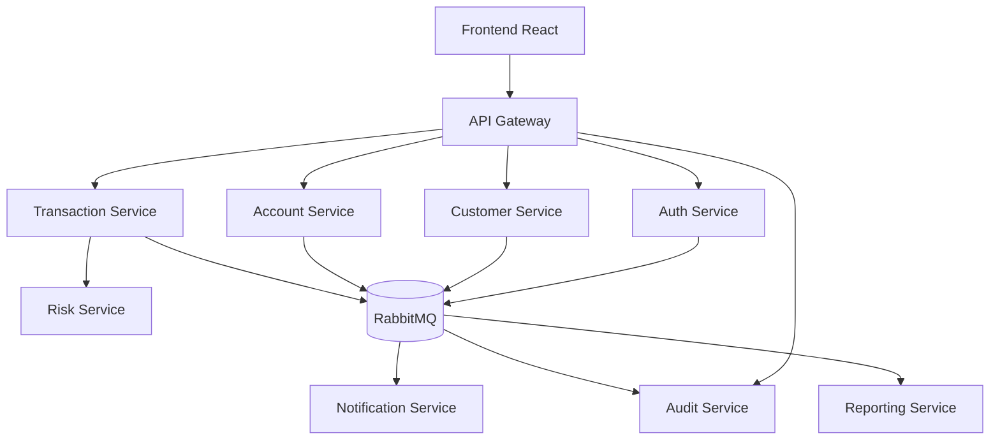

# SecureMicroservicesBank

SecureMicroservicesBank est un projet pédagogique avancé qui simule une application bancaire moderne construite avec une architecture microservices et une démarche DevSecOps de bout en bout.

L’objectif est de construire progressivement un système bancaire fictif sécurisé, testé, conteneurisé, déployé sur Kubernetes et observable. Le projet utilise exclusivement des données de démonstration : il ne traite aucun paiement réel et n’est pas destiné à la production.

## État actuel du projet

Le dépôt est en phase d’initialisation technique. La documentation d’architecture décrit la cible complète, tandis que l’implémentation applicative se concentre actuellement sur les fondations de `auth-service`.

| Domaine | État | Contenu actuel |
|---|---|---|
| Cadrage fonctionnel et architecture | Réalisé | Périmètre, cas d’utilisation, règles métier, responsabilités, propriété des données et modèle de menace STRIDE |
| PostgreSQL local | Réalisé | PostgreSQL 17 avec Docker Compose, volume persistant, base et utilisateur dédiés à `auth-service` |
| `auth-service` | En cours | Squelette Spring Boot, configuration JPA/Flyway, migration `users`, entité initiale et Actuator |
| APIs d’authentification | Planifié | Inscription, connexion, JWT, refresh token, déconnexion, verrouillage et MFA simple |
| Autres microservices du MVP | Planifié | Gateway, Customer, Account, Transaction et Audit |
| DevSecOps et cloud-native | Planifié | CI/CD, scans de sécurité, images Docker, Kubernetes, SBOM, signature et observabilité |

> Les fonctionnalités décrites dans la cible d’architecture ne sont pas nécessairement déjà implémentées. Consultez toujours ce tableau et le code du dépôt pour connaître l’état réel.

## Parcours fonctionnel cible

Le premier flux vertical du MVP est :

```text
Inscription -> Connexion JWT -> Profil client -> Compte bancaire
            -> Virement idempotent -> Audit
```

Le système final doit notamment garantir qu’un client ne peut consulter que ses propres ressources, qu’un virement n’est jamais exécuté deux fois et que toute opération sensible produit un événement d’audit.

## Architecture cible



Principes structurants :

- une responsabilité métier principale par service ;
- une base logique PostgreSQL par service ;
- aucun accès direct à la base d’un autre service ;
- REST pour les réponses synchrones nécessaires ;
- événements pour l’audit, les notifications et le reporting ;
- contrôles d’autorisation appliqués dans chaque service, pas uniquement dans la gateway ;
- sécurité et traçabilité intégrées dès la conception.

Dans l’état actuel, seul `auth_db` est créé par Docker Compose.

## Technologies

### Technologies actuellement présentes

| Technologie | Utilisation et justification |
|---|---|
| Java 21 | Version LTS moderne pour les microservices backend |
| Spring Boot 4.1.0 | Configuration et démarrage de `auth-service` |
| Spring Web MVC | Fondation des futures APIs REST |
| Spring Data JPA | Mapping entre le domaine Java et PostgreSQL |
| Flyway | Migrations SQL versionnées et reproductibles |
| PostgreSQL 17 | Contraintes relationnelles et transactions locales fortes |
| Docker Compose | Environnement PostgreSQL local reproductible |
| JUnit 5 et Testcontainers | Tests d’intégration contre un véritable PostgreSQL éphémère |
| Spring Boot Actuator | Endpoints de santé et d’information technique |

### Technologies prévues

- Spring Security, JWT, RBAC et BCrypt ou Argon2 ;
- Spring Cloud Gateway ;
- React, TypeScript et Vite ;
- RabbitMQ pour les événements ;
- GitHub Actions, SAST, SCA, secret scanning, Trivy, Checkov et OWASP ZAP ;
- Docker, Kubernetes et Kustomize ou Helm ;
- Prometheus, Grafana, Loki et Falco ;
- CycloneDX ou Syft pour les SBOM et Cosign pour la signature des images.

## Structure actuelle du dépôt

```text
secure-microservices-bank/
|-- docker/
|   `-- postgres-init/              # Initialisation sécurisée de PostgreSQL
|-- docs/
|   |-- architecture/               # Responsabilités et propriété des données
|   `-- security/                   # Modèle de menace initial
|-- security/
|   `-- risk-acceptance.md          # Registre des exceptions de sécurité
|-- services/
|   `-- auth-service/               # Premier microservice Spring Boot
|-- .env.example                    # Variables attendues, sans secret réel
|-- docker-compose.yml              # PostgreSQL local
|-- README.md
`-- SECURITY.md
```

## Prérequis

- Git ;
- Java 21 ;
- Docker Desktop avec Docker Compose v2 ;
- IntelliJ IDEA ou un autre IDE compatible Java, facultatif.

Une installation globale de Maven n’est pas nécessaire : `auth-service` fournit Maven Wrapper 3.3.4, qui télécharge Maven 3.9.16 lors de la première utilisation.

Vérifiez votre environnement :

```powershell
git --version
java --version
docker --version
docker compose version
```

## Démarrage local sous Windows PowerShell

### 1. Cloner le dépôt

```powershell
git clone https://github.com/Yassbhr12/secure-microservices-bank.git
Set-Location secure-microservices-bank
```

### 2. Créer la configuration locale

```powershell
Copy-Item .env.example .env
notepad .env
```

Renseignez des mots de passe locaux forts et différents :

```dotenv
POSTGRES_ADMIN_PASSWORD=<mot-de-passe-administrateur-local>

AUTH_DB_NAME=auth_db
AUTH_DB_USERNAME=auth_service_user
AUTH_DB_PASSWORD=<mot-de-passe-auth-service-local>
AUTH_DB_URL=jdbc:postgresql://localhost:5433/auth_db
```

Ne commitez jamais `.env`. Seul `.env.example`, sans valeurs sensibles, doit rester dans Git.

Le script d’initialisation PostgreSQL ne s’exécute que lors de la création d’un volume vide. Si vous modifiez ensuite le nom de la base, l’utilisateur ou son mot de passe, vous devrez recréer volontairement le volume avec `docker compose down -v` avant de redémarrer PostgreSQL. Cette opération efface les données locales existantes.

### 3. Valider et démarrer PostgreSQL

```powershell
docker compose config --quiet
docker compose up -d postgres
docker compose ps
```

Le port doit être publié uniquement sur la boucle locale :

```text
127.0.0.1:5433->5432/tcp
```

Vérifiez la base et l’utilisateur applicatif :

```powershell
docker compose exec postgres bash -lc 'PGPASSWORD="$AUTH_DB_PASSWORD" psql -h 127.0.0.1 -U "$AUTH_DB_USERNAME" -d "$AUTH_DB_NAME" -At -c "SELECT current_user, current_database();"'
```

Résultat attendu :

```text
auth_service_user|auth_db
```

### 4. Configurer le processus Spring Boot

Docker Compose lit automatiquement `.env`, mais une application lancée directement depuis IntelliJ ou PowerShell ne le charge pas automatiquement. Définissez donc les variables dans le terminal qui exécutera `auth-service` :

```powershell
$env:AUTH_DB_URL = "jdbc:postgresql://localhost:5433/auth_db"
$env:AUTH_DB_USERNAME = "auth_service_user"
$env:AUTH_DB_PASSWORD = "<même-valeur-que-dans-.env>"
```

Dans IntelliJ, les mêmes variables peuvent être ajoutées dans la configuration d’exécution de `AuthServiceApplication`.

### 5. Démarrer `auth-service`

```powershell
Set-Location services/auth-service
.\mvnw.cmd spring-boot:run
```

Le service écoute sur le port `8081`.

### 6. Vérifier la santé du service

```powershell
Invoke-RestMethod http://localhost:8081/actuator/health
```

Résultat attendu :

```json
{
  "status": "UP"
}
```

Endpoints actuellement disponibles :

| Méthode | Endpoint | État |
|---|---|---|
| `GET` | `/actuator/health` | Disponible |
| `GET` | `/actuator/info` | Disponible |
| `POST` | `/api/auth/register` | Pas encore implémenté |
| `POST` | `/api/auth/login` | Pas encore implémenté |

### 7. Arrêter l’environnement

Depuis la racine du dépôt :

```powershell
docker compose down
```

N’utilisez `docker compose down -v` que pour réinitialiser volontairement la base. L’option `-v` supprime définitivement le volume PostgreSQL local et toutes ses données.

## Exécution sous Linux ou macOS

Les étapes Docker restent identiques. Après avoir exporté `AUTH_DB_URL`, `AUTH_DB_USERNAME` et `AUTH_DB_PASSWORD` dans le terminal, démarrez le service avec :

```bash
cd services/auth-service
bash ./mvnw spring-boot:run
```

## Tests

Docker doit être démarré, car le test de contexte utilise Testcontainers et PostgreSQL 17. Les variables `AUTH_DB_URL`, `AUTH_DB_USERNAME` et `AUTH_DB_PASSWORD` doivent également être disponibles dans le terminal utilisé.

Sous Windows :

```powershell
Set-Location services/auth-service
.\mvnw.cmd test
```

Sous Linux ou macOS :

```bash
cd services/auth-service
bash ./mvnw test
```

## Documentation du projet

- [Périmètre du projet](docs/project-scope.md)
- [Cas d’utilisation](docs/use-cases.md)
- [Règles métier](docs/business-rules.md)
- [Responsabilités des microservices](docs/architecture/service-responsibilities.md)
- [Propriété et gouvernance des données](docs/architecture/data-ownership.md)
- [Modèle de menace STRIDE](docs/security/initial-threat-model.md)
- [Registre d’acceptation des risques](security/risk-acceptance.md)

## Règles de sécurité essentielles

- utiliser uniquement des données fictives ;
- ne jamais commiter de secret, token, mot de passe réel ou fichier `.env` ;
- ne jamais journaliser un mot de passe ou un token ;
- hacher les mots de passe avec BCrypt ou Argon2 avant leur persistance ;
- appliquer le moindre privilège aux utilisateurs de base de données ;
- valider les entrées et retourner des erreurs publiques génériques ;
- vérifier les rôles et la propriété des ressources dans chaque service ;
- documenter toute exception dans `security/risk-acceptance.md`.

Consultez [SECURITY.md](SECURITY.md) avant de signaler une vulnérabilité ou de contribuer à une partie sensible.

## Méthode de contribution

1. synchroniser `main` ;
2. créer une branche courte et ciblée ;
3. effectuer un changement cohérent ;
4. exécuter les tests et vérifier qu’aucun secret n’est présent ;
5. ouvrir une pull request expliquant le besoin, la solution et les validations réalisées ;
6. fusionner uniquement après validation.

## Feuille de route prioritaire

1. terminer le modèle `User` et les migrations de `auth-service` ;
2. ajouter repository, DTO, validation et gestion globale des erreurs ;
3. implémenter inscription, hashage du mot de passe et tests ;
4. ajouter connexion, JWT, refresh token et verrouillage temporaire ;
5. développer Gateway et Customer Service ;
6. développer Account et Transaction avec idempotence et contrôle de concurrence ;
7. introduire RabbitMQ et Audit Service ;
8. ajouter progressivement CI/CD, contrôles DevSecOps, Kubernetes et observabilité.

## Avertissement

Ce projet est une simulation académique et un support de portfolio. Il ne fournit aucun service bancaire réel, ne doit contenir aucune donnée personnelle réelle et n’est pas homologué pour un usage de production.

Aucune licence open source n’est définie pour le moment.
