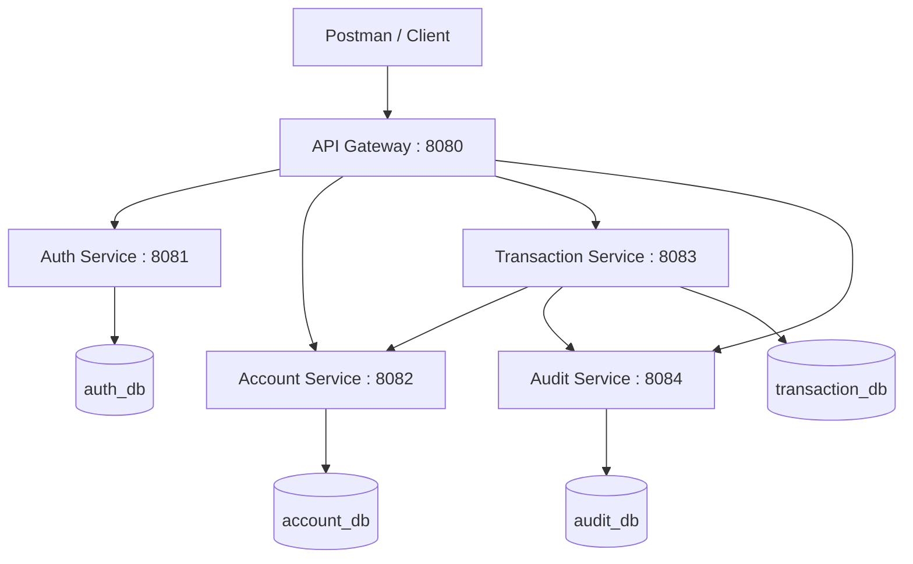

# SecureMicroservicesBank

SecureMicroservicesBank est une application bancaire fictive construite avec une architecture microservices sécurisée.

Le projet démontre l’authentification JWT, la rotation des refresh tokens, le contrôle d’accès par rôles, la gestion de comptes, les virements idempotents, l’audit des opérations et la conteneurisation avec Docker Compose.

> Ce projet est réalisé à des fins académiques. Il utilise uniquement des données fictives et n’est pas destiné à un environnement bancaire réel.

## État du projet

Le MVP backend est fonctionnel et conteneurisé.

| Composant | État | Responsabilité |
|---|---|---|
| API Gateway | Terminé | Point d’entrée unique et routage |
| Auth Service | Terminé | Inscription, connexion, JWT, refresh et logout |
| Account Service | Terminé | Création, consultation et gestion des soldes |
| Transaction Service | Terminé | Virements et idempotence |
| Audit Service | Terminé | Traçabilité immuable des opérations |
| PostgreSQL | Terminé | Bases logiques séparées par service |
| Docker Compose | Terminé | Construction et démarrage de l’environnement |
| Frontend | Hors MVP | Démonstration effectuée avec Postman |
| Kubernetes | Reporté | Prévu comme évolution |
| Messaging | Reporté | Kafka ou RabbitMQ prévu ultérieurement |

## Fonctionnalités principales

### Authentification et sécurité

- inscription d’un utilisateur ;
- normalisation et unicité des adresses e-mail ;
- hachage des mots de passe avec BCrypt ;
- connexion avec access token JWT signé en RSA ;
- access token de courte durée ;
- refresh token opaque stocké sous forme de hash ;
- rotation des refresh tokens ;
- détection de réutilisation d’un ancien token ;
- révocation d’une famille de tokens ;
- logout avec révocation du refresh token ;
- autorisation basée sur les rôles ;
- validation locale du JWT dans chaque service concerné.

### Comptes

- création de comptes bancaires fictifs ;
- numéro de compte unique ;
- devise MAD ;
- consultation des comptes appartenant à l’utilisateur ;
- contrôle de propriété des ressources ;
- gestion de l’état du compte ;
- contrôle de concurrence avec version optimiste.

### Transactions

- transfert entre deux comptes ;
- validation du montant et des comptes ;
- débit et crédit atomiques dans Account Service ;
- rejet en cas de solde insuffisant ;
- clé d’idempotence ;
- prévention d’un double débit ;
- historique des transferts de l’utilisateur.

### Audit

- enregistrement des transferts réussis ou échoués ;
- identification de l’acteur et du service source ;
- niveau de sévérité et résultat de l’opération ;
- consultation réservée aux rôles autorisés ;
- événements d’audit immuables.

## Architecture


```mermaid
flowchart TB
  Client["Postman / Client"] --> Gateway["API Gateway : 8080"]

  Gateway --> Auth["Auth Service : 8081"]
  Gateway --> Account["Account Service : 8082"]
  Gateway --> Transaction["Transaction Service : 8083"]
  Gateway --> Audit["Audit Service : 8084"]

  Transaction --> Account
  Transaction --> Audit

  Auth --> AuthDB[("auth_db")]
  Account --> AccountDB[("account_db")]
  Transaction --> TransactionDB[("transaction_db")]
  Audit --> AuditDB[("audit_db")]
```

L’API Gateway est le seul point d’entrée applicatif publié sur la machine hôte.

Les communications internes utilisent le réseau Docker et les noms DNS des services :

```text
http://auth-service:8081
http://account-service:8082
http://transaction-service:8083
http://audit-service:8084
```

## Principes d’architecture

- responsabilité métier distincte pour chaque microservice ;
- base logique et utilisateur PostgreSQL dédiés par service ;
- aucune lecture directe de la base d’un autre service ;
- API Gateway comme point d’entrée unique ;
- validation du JWT dans les services métier ;
- contrôles de rôle et de propriété côté serveur ;
- migrations SQL versionnées avec Flyway ;
- configurations injectées par variables d’environnement ;
- secrets exclus du dépôt Git ;
- images Docker construites avec des Dockerfiles multi-stage ;
- exécution des conteneurs applicatifs avec un utilisateur non-root.

## Technologies

| Technologie | Utilisation |
|---|---|
| Java 21 | Langage backend |
| Spring Boot 4.1.1 | Framework applicatif |
| Spring Web MVC | APIs REST et API Gateway |
| Spring Security | Authentification et autorisation |
| OAuth2 Resource Server | Validation des JWT |
| Spring Data JPA | Persistance |
| Hibernate | Mapping objet-relationnel |
| Flyway | Migrations de bases de données |
| PostgreSQL 17 | Stockage relationnel |
| Docker | Construction des images |
| Docker Compose | Orchestration locale |
| Maven | Build et dépendances |
| JUnit 5 | Tests |
| Mockito | Tests unitaires |
| Testcontainers | Tests avec PostgreSQL |
| Postman | Tests fonctionnels |

## Structure du dépôt

```text
secure-microservices-bank/
├── docker/
│   └── postgres-init/
├── docs/
│   ├── architecture/
│   └── security/
├── security/
├── services/
│   ├── api-gateway/
│   ├── auth-service/
│   ├── account-service/
│   ├── transaction-service/
│   └── audit-service/
├── .env.example
├── .gitignore
├── docker-compose.yml
├── README.md
└── SECURITY.md
```

Chaque service contient son propre :

- projet Maven ;
- code source ;
- configuration Spring Boot ;
- Dockerfile multi-stage ;
- fichier `.dockerignore` ;
- ensemble de tests ;
- migrations Flyway lorsqu’une base est utilisée.

## Prérequis

Pour démarrer l’environnement complet :

- Git ;
- Docker Desktop ;
- Docker Compose v2 ;
- OpenSSL pour générer les clés RSA.

Java et Maven ne sont pas obligatoires pour un démarrage exclusivement avec Docker.

## Installation

### 1. Cloner le dépôt

```powershell
git clone https://github.com/Yassbhr12/secure-microservices-bank.git
Set-Location secure-microservices-bank
```

### 2. Créer la configuration locale

```powershell
Copy-Item .env.example .env
notepad .env
```

Renseignez toutes les valeurs laissées vides dans `.env`, notamment :

```dotenv
POSTGRES_ADMIN_PASSWORD=<secret-local>

AUTH_DB_PASSWORD=<secret-local>
ACCOUNT_DB_PASSWORD=<secret-local>
TRANSACTION_DB_PASSWORD=<secret-local>
AUDIT_DB_PASSWORD=<secret-local>

INTERNAL_API_KEY=<valeur-aleatoire-de-plus-de-32-caracteres>
```

Le fichier `.env` ne doit jamais être ajouté à Git.

### 3. Générer les clés RSA

Depuis la racine du projet :

```powershell
New-Item `
    -ItemType Directory `
    -Force `
    -Path services/auth-service/secrets
```

Avec OpenSSL :

```powershell
openssl genpkey `
    -algorithm RSA `
    -out services/auth-service/secrets/jwt-private.pem `
    -pkeyopt rsa_keygen_bits:3072
```

```powershell
openssl pkey `
    -in services/auth-service/secrets/jwt-private.pem `
    -pubout `
    -out services/auth-service/secrets/jwt-public.pem
```

Les clés sont exclues de Git. Docker Compose les monte dans les conteneurs sous forme de secrets.

### 4. Valider la configuration

```powershell
docker compose config --quiet
```

Une absence de sortie indique que la syntaxe et les variables obligatoires sont valides.

### 5. Construire et démarrer le projet

```powershell
docker compose up -d --build
```

### 6. Vérifier les conteneurs

```powershell
docker compose ps
```

Les conteneurs suivants doivent être `healthy` :

```text
secure-bank-postgres
secure-bank-auth-service
secure-bank-account-service
secure-bank-transaction-service
secure-bank-audit-service
secure-bank-api-gateway
```

### 7. Vérifier la Gateway

```powershell
Invoke-RestMethod `
    http://localhost:8080/actuator/health
```

Résultat attendu :

```json
{
  "status": "UP"
}
```

## Ports

| Composant | Port interne | Publication sur l’hôte |
|---|---:|---|
| API Gateway | 8080 | `127.0.0.1:8080` |
| Auth Service | 8081 | Non publié |
| Account Service | 8082 | Non publié |
| Transaction Service | 8083 | Non publié |
| Audit Service | 8084 | Non publié |
| PostgreSQL | 5432 | `127.0.0.1:5433` |

Les APIs doivent être appelées via :

```text
http://localhost:8080
```

## Endpoints du MVP

### Authentification

| Méthode | Endpoint | Accès |
|---|---|---|
| POST | `/api/v1/auth/register` | Public |
| POST | `/api/v1/auth/login` | Public |
| GET | `/api/v1/auth/me` | JWT |
| POST | `/api/v1/auth/refresh` | Refresh token |
| POST | `/api/v1/auth/logout` | Refresh token |

### Comptes

| Méthode | Endpoint | Accès |
|---|---|---|
| POST | `/api/v1/accounts` | `CLIENT` |
| GET | `/api/v1/accounts` | `CLIENT` |
| GET | `/api/v1/accounts/{accountId}` | Propriétaire |

### Transactions

| Méthode | Endpoint | Accès |
|---|---|---|
| POST | `/api/v1/transfers` | `CLIENT` |
| GET | `/api/v1/transfers` | `CLIENT` |
| GET | `/api/v1/transfers/{transferId}` | Propriétaire |

La création d’un transfert accepte l’en-tête :

```http
Idempotency-Key: <UUID>
```

Une même clé avec une même requête retourne le résultat initial sans effectuer un second débit.

### Audit

| Méthode | Endpoint | Accès |
|---|---|---|
| GET | `/api/v1/audit-events` | `ADMIN` ou `AUDITOR` |
| GET | `/api/v1/audit-events/{eventId}` | `ADMIN` ou `AUDITOR` |

## Scénario fonctionnel validé

Le flux principal testé avec Postman est :

```text
Inscription
→ Connexion
→ Vérification de /me
→ Création de deux comptes
→ Ajout d’un solde fictif de démonstration
→ Virement avec Idempotency-Key
→ Vérification des soldes
→ Rejeu idempotent
→ Consultation de l’audit
→ Rotation du refresh token
→ Détection de la réutilisation
→ Logout
→ Refus du refresh token révoqué
```

Un solde fictif est injecté directement dans la base de démonstration, car les opérations de dépôt et de retrait ne font pas partie du MVP.

## Tests

Les services disposent de tests adaptés à leurs responsabilités :

- tests unitaires du domaine et des services ;
- tests MVC des contrôleurs et de la sécurité ;
- tests de repositories ;
- tests d’intégration PostgreSQL avec Testcontainers ;
- tests fonctionnels du cycle complet avec Postman.

Depuis le dossier d’un service disposant du Maven Wrapper :

```powershell
.\mvnw.cmd clean test
```

Ou avec une installation Maven globale :

```powershell
mvn clean test
```

## Arrêt de l’environnement

```powershell
docker compose down
```

Cette commande conserve les données PostgreSQL.

Pour supprimer volontairement les données locales :

```powershell
docker compose down -v
```

> Attention : l’option `-v` supprime définitivement le volume PostgreSQL et toutes ses données locales.

## Sécurité

Les principales mesures appliquées sont :

- BCrypt pour les mots de passe ;
- signature RSA des JWT ;
- access tokens courts ;
- refresh tokens opaques et hachés ;
- rotation et détection du rejeu ;
- RBAC ;
- contrôle de propriété ;
- clés internes pour les endpoints interservices ;
- validation des DTO ;
- erreurs HTTP contrôlées ;
- secrets exclus de Git ;
- utilisateurs PostgreSQL dédiés ;
- conteneurs non-root ;
- option Docker `no-new-privileges` ;
- exposition réseau minimale.

Consultez [SECURITY.md](SECURITY.md) et le modèle de menace dans `docs/security`.

## Limites du MVP

Les éléments suivants ne sont pas présentés comme implémentés :

- frontend web ;
- dépôts et retraits bancaires ;
- Kafka ou RabbitMQ ;
- Risk Service ;
- Notification Service ;
- Reporting avancé ;
- Kubernetes ;
- déploiement cloud ;
- observabilité complète ;
- MFA ;
- système bancaire réel.

Ces éléments constituent des évolutions possibles.

## Documentation

- [Périmètre](docs/project-scope.md)
- [Cas d’utilisation](docs/use-cases.md)
- [Règles métier](docs/business-rules.md)
- [Responsabilités des services](docs/architecture/service-responsibilities.md)
- [Propriété des données](docs/architecture/data-ownership.md)
- [Modèle de menace](docs/security/initial-threat-model.md)
- [Politique de sécurité](SECURITY.md)

## Auteur

**BAHRA Ahmed Yassine**  
Élève ingénieur en Génie Informatique  
ENSA Khouribga

## Avertissement

SecureMicroservicesBank est une simulation académique. Le logiciel ne doit traiter aucune donnée bancaire réelle et n’est pas homologué pour un usage en production.
