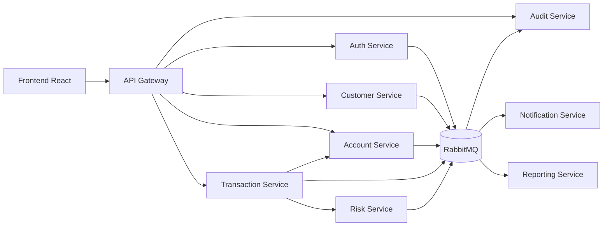
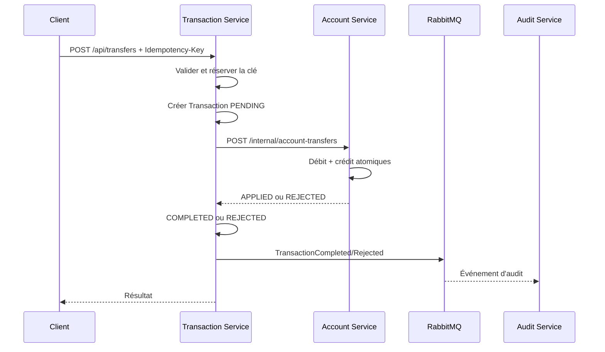

# SecureMicroservicesBank — Responsabilités des microservices

**Document :** Frontières et responsabilités des services  
**Projet :** SecureMicroservicesBank  
**Version :** 1.0  
**Statut :** Proposition d’architecture à valider  
**Documents parents :**
- `docs/project-scope.md`
- `docs/use-cases.md`
- `docs/business-rules.md`

**Référence :** Cahier des charges SecureMicroservicesBank, version 1.0 du 19 juin 2026

---

## 1. Objectif du document

Ce document définit les frontières fonctionnelles et techniques de chaque composant de SecureMicroservicesBank.

Pour chaque service, il précise :

- sa mission ;
- les données dont il est propriétaire ;
- les fonctionnalités qu’il expose ;
- les services qu’il peut appeler ;
- les événements qu’il produit ou consomme ;
- les contrôles de sécurité qu’il doit appliquer ;
- les responsabilités qu’il ne doit pas prendre ;
- les conditions permettant de considérer sa première version comme terminée.

L’objectif principal est d’éviter trois problèmes fréquents dans une architecture microservices :

1. plusieurs services modifient les mêmes données ;
2. la logique métier est dispersée dans la gateway ou le frontend ;
3. les services deviennent fortement couplés et ne peuvent plus évoluer indépendamment.

---

## 2. Principes d’architecture

### 2.1 Un service possède une responsabilité métier principale

Chaque microservice doit répondre à une question claire.

| Service | Question principale |
|---|---|
| `api-gateway` | Comment une requête externe entre-t-elle dans le système ? |
| `auth-service` | Qui est l’utilisateur et comment s’authentifie-t-il ? |
| `customer-service` | Quel est le profil bancaire fictif du client ? |
| `account-service` | Quels comptes existent et quel est leur état financier ? |
| `transaction-service` | Quel est le cycle de vie d’une demande de virement ? |
| `audit-service` | Quelles actions critiques ont eu lieu ? |
| `risk-service` | Une transaction présente-t-elle un risque ? |
| `notification-service` | Quel message doit être envoyé à l’utilisateur ? |
| `reporting-service` | Quels indicateurs agrégés doivent être présentés ? |

---

### 2.2 Un seul propriétaire par donnée

Une donnée ne peut être modifiée que par son service propriétaire.

Exemples :

```text
Mot de passe      → auth-service
Profil client     → customer-service
Solde du compte   → account-service
Statut du virement→ transaction-service
Journal d’audit   → audit-service
```

Un autre service doit utiliser une API ou un événement. Il ne doit jamais accéder directement à la table concernée.

---

### 2.3 Contrôle d’accès en profondeur

La gateway effectue des contrôles généraux, mais elle n’est pas l’unique barrière de sécurité.

Chaque service doit également :

- valider le JWT ou utiliser un mécanisme interne de confiance explicite ;
- vérifier les rôles ;
- vérifier la propriété des ressources ;
- valider les entrées ;
- refuser les transitions métier invalides.

```text
Gateway : contrôle général
Service : autorisation métier finale
```

---

### 2.4 Pas de logique métier dans la gateway

La gateway peut :

- router ;
- limiter le trafic ;
- appliquer CORS ;
- vérifier la validité générale d’un token ;
- générer un `correlationId`.

Elle ne doit pas :

- calculer un solde ;
- décider si un virement est possible ;
- modifier un profil ;
- attribuer un rôle ;
- produire les règles de risque.

---

### 2.5 Communication synchrone seulement lorsque la réponse est nécessaire

REST est utilisé lorsque le service appelant a besoin d’une réponse immédiate.

Exemples :

- vérifier le statut d’un compte ;
- exécuter un transfert atomique entre deux comptes ;
- obtenir le profil lié à un utilisateur.

Les événements sont préférés pour les traitements secondaires :

- audit ;
- notification ;
- reporting ;
- alertes de risque.

---

### 2.6 Aucune dépendance circulaire

Une dépendance circulaire est interdite.

Exemple interdit :

```text
account-service
    appelle transaction-service
        appelle account-service
```

Le sens des dépendances doit être stable et documenté.

---

### 2.7 Les contrats sont versionnés

Les APIs et événements doivent posséder des contrats explicites :

- OpenAPI pour REST ;
- schémas JSON ou AsyncAPI pour les événements ;
- version dans le chemin, le header ou le schéma selon la stratégie retenue.

Une modification incompatible doit produire une nouvelle version ou suivre une migration contrôlée.

---

## 3. Vue d’ensemble



### Périmètre du premier MVP

```text
api-gateway
auth-service
customer-service
account-service
transaction-service
audit-service
```

### Services ajoutés ensuite

```text
risk-service
notification-service
reporting-service
```

---

# 4. API Gateway

## 4.1 Mission

Fournir un point d’entrée unique pour le frontend et les clients externes.

Technologie proposée :

```text
Spring Cloud Gateway
```

---

## 4.2 Responsabilités

La gateway doit :

- router les requêtes vers le bon microservice ;
- refuser les routes inconnues ;
- appliquer une politique CORS explicite ;
- vérifier la présence et la validité générale du JWT sur les routes protégées ;
- laisser accessibles uniquement les routes publiques nécessaires ;
- appliquer un rate limiting sur les routes sensibles ;
- créer ou propager un `correlationId` ;
- supprimer les headers d’identité non fiables fournis par le client ;
- transmettre le JWT aux services ;
- produire des logs techniques sans secrets ;
- ajouter les headers de sécurité adaptés ;
- retourner une réponse générique lorsqu’un service est indisponible.

---

## 4.3 Routes initiales

| Route externe | Destination |
|---|---|
| `/api/auth/**` | `auth-service` |
| `/api/customers/**` | `customer-service` |
| `/api/accounts/**` | `account-service` |
| `/api/transfers/**` | `transaction-service` |
| `/api/transactions/**` | `transaction-service` |
| `/api/audit-events/**` | `audit-service` |

Les routes administratives restent sous les mêmes domaines, avec autorisation renforcée.

---

## 4.4 Données possédées

La gateway ne possède aucune donnée métier.

Elle peut conserver uniquement de la configuration technique ou un état temporaire nécessaire au rate limiting.

Elle ne doit pas avoir de base PostgreSQL métier.

---

## 4.5 Dépendances

La gateway peut appeler :

- tous les services exposés au frontend ;
- éventuellement un composant de découverte de services plus tard.

Elle ne doit pas appeler directement PostgreSQL.

---

## 4.6 Contrôles de sécurité

- validation de la signature et de l’expiration du JWT ;
- CORS sans wildcard en environnement de démonstration finale ;
- taille maximale des requêtes ;
- rate limiting sur login, refresh et virements ;
- suppression des headers internes reçus depuis Internet ;
- timeouts ;
- aucun message interne détaillé retourné au client.

---

## 4.7 Responsabilités interdites

La gateway ne doit pas :

- créer un utilisateur ;
- vérifier la propriété détaillée d’un compte ;
- modifier un solde ;
- enregistrer une transaction métier ;
- attribuer une décision de risque ;
- remplacer les contrôles d’autorisation des services.

---

## 4.8 Critères de fin de première version

- toutes les routes du MVP sont accessibles via la gateway ;
- les routes protégées refusent un token absent ou invalide ;
- un `correlationId` est visible dans la réponse et les logs ;
- le CORS est limité aux origines configurées ;
- le rate limiting protège au minimum le login ;
- la gateway ne contient aucune logique bancaire.

---

# 5. Auth Service

## 5.1 Mission

Gérer l’identité, l’authentification, les rôles, les sessions et les tokens.

---

## 5.2 Données possédées

Le service possède :

```text
User
Role ou rôle utilisateur
RefreshToken / Session
LoginAttempt ou état de verrouillage
MfaChallenge, lorsqu’il sera ajouté
```

Champs principaux :

```text
userId
email
passwordHash
role
enabled
accountLocked
failedLoginAttempts
lockedUntil
createdAt
updatedAt
```

---

## 5.3 APIs publiques initiales

```http
POST /api/auth/register
POST /api/auth/login
POST /api/auth/refresh
POST /api/auth/logout
POST /api/auth/mfa/verify
```

L’endpoint MFA peut être ajouté après le premier flux de connexion.

---

## 5.4 APIs administratives

Exemples envisagés :

```http
GET   /api/admin/users
PATCH /api/admin/users/{id}/status
PATCH /api/admin/users/{id}/role
POST  /api/admin/users/{id}/sessions/revoke
```

Toute modification de rôle ou de statut doit être auditée.

---

## 5.5 Règles appliquées

Le service applique notamment :

- unicité de l’email ;
- politique de mot de passe ;
- hashage BCrypt ou Argon2 ;
- création publique avec le rôle `CLIENT` uniquement ;
- limitation des tentatives ;
- blocage temporaire ;
- expiration de l’access token ;
- rotation et révocation du refresh token ;
- génération d’événements d’authentification.

---

## 5.6 Événements produits

```text
UserRegistered
LoginSucceeded
LoginFailed
UserTemporarilyLocked
TokenRefreshed
SessionRevoked
UserRoleChanged
UserStatusChanged
```

Ces événements sont destinés en priorité à :

- `audit-service` ;
- `notification-service` ;
- `reporting-service`.

---

## 5.7 Événements consommés

Dans le MVP, aucun événement métier n’est obligatoire.

Évolution possible :

- désactivation coordonnée d’un client ;
- demande globale de révocation après incident de sécurité.

---

## 5.8 Dépendances

Le service dépend de :

- sa propre base PostgreSQL ;
- un fournisseur d’email ou `notification-service` pour le MFA, plus tard ;
- RabbitMQ pour publier les événements.

Il ne dépend pas de :

- `account-service` ;
- `transaction-service` ;
- la base de données du `customer-service`.

---

## 5.9 Contrôles de sécurité

- aucun mot de passe en clair ;
- tokens non journalisés ;
- refresh tokens protégés ;
- comparaison de mot de passe via `PasswordEncoder` ;
- erreurs de connexion génériques ;
- rate limiting combiné entre gateway et service ;
- journalisation des changements de rôle ;
- secrets JWT fournis par configuration externe.

---

## 5.10 Responsabilités interdites

Le service ne doit pas :

- stocker le profil détaillé du client ;
- créer un compte bancaire ;
- connaître le solde ;
- enregistrer un virement ;
- permettre au visiteur de choisir le rôle `ADMIN`.

---

## 5.11 Critères de fin de première version

- inscription avec email unique ;
- mot de passe haché ;
- connexion et access token ;
- refresh token révocable ;
- blocage après plusieurs échecs ;
- rôles `CLIENT`, `ADMIN` et `AUDITOR` ;
- tests d’échec, expiration et autorisation ;
- événements d’audit sans secret.

---

# 6. Customer Service

## 6.1 Mission

Gérer le profil bancaire fictif et les informations personnelles minimales du client.

---

## 6.2 Données possédées

```text
Customer
CustomerStatus
CustomerProfileHistory, optionnel
```

Champs principaux :

```text
customerId
authUserId
customerNumber
firstName
lastName
emailContact
phone
address
status
createdAt
updatedAt
```

`authUserId` est une référence logique vers l’identité, pas une clé étrangère interbase.

---

## 6.3 APIs client

```http
POST /api/customers
GET  /api/customers/me
PUT  /api/customers/me
```

La création pourra aussi être automatisée après `UserRegistered`.

---

## 6.4 APIs administratives

```http
GET   /api/admin/customers
GET   /api/admin/customers/{id}
PATCH /api/admin/customers/{id}/status
```

Les collections doivent être paginées.

---

## 6.5 Règles appliquées

- un profil par identité ;
- consultation du profil propre uniquement ;
- modification limitée aux champs autorisés ;
- statut administratif modifiable par `ADMIN` seulement ;
- aucune suppression physique dans le MVP ;
- masquage des données techniques.

---

## 6.6 Événements produits

```text
CustomerCreated
CustomerProfileUpdated
CustomerActivated
CustomerDisabled
```

---

## 6.7 Événements consommés

Option recommandée :

```text
UserRegistered
```

Le service peut créer automatiquement un profil minimal ou attendre que le client complète son profil.

La stratégie finale doit être unique :

### Option A — Création synchrone explicite

Après inscription, le frontend appelle `POST /api/customers`.

### Option B — Création événementielle

`customer-service` consomme `UserRegistered` et crée un profil incomplet.

**Décision recommandée pour le premier incrément :** Option A, plus simple à observer et à tester.  
**Évolution recommandée :** Option B lorsque RabbitMQ et la gestion des reprises sont maîtrisés.

---

## 6.8 Dépendances

Le service dépend de :

- sa propre base PostgreSQL ;
- l’identité issue du JWT ;
- RabbitMQ pour publier ses événements.

Il ne doit pas appeler `auth-service` à chaque consultation si l’identité nécessaire existe déjà dans le token.

---

## 6.9 Contrôles de sécurité

- comparaison entre `authUserId` du token et le profil ;
- validation stricte des champs ;
- données fictives uniquement ;
- pagination et filtrage limités pour les administrateurs ;
- aucun mot de passe ni token dans la base ;
- audit des changements de statut.

---

## 6.10 Responsabilités interdites

Le service ne doit pas :

- vérifier un mot de passe ;
- émettre un JWT ;
- créer ou modifier un solde ;
- enregistrer une transaction ;
- attribuer des rôles de sécurité.

---

## 6.11 Critères de fin de première version

- création d’un profil unique ;
- consultation avec `/me` ;
- modification limitée ;
- désactivation par `ADMIN` ;
- accès interdit au profil d’un autre client ;
- événements d’audit pour les actions critiques.

---

# 7. Account Service

## 7.1 Mission

Gérer les comptes bancaires fictifs, leurs propriétaires, leurs statuts et leurs soldes.

Il est l’unique autorité sur le solde.

---

## 7.2 Données possédées

```text
BankAccount
AccountStatus
BalanceOperation
ProcessedTransferOperation
```

Champs principaux du compte :

```text
accountId
customerId
accountNumber
balance
currency
status
version
createdAt
updatedAt
```

`ProcessedTransferOperation` sert à empêcher l’exécution multiple d’une même commande interne.

---

## 7.3 APIs client

```http
GET /api/accounts
GET /api/accounts/{id}
```

Ces APIs filtrent les résultats selon le propriétaire authentifié.

---

## 7.4 APIs administratives

```http
POST  /api/admin/accounts
PATCH /api/admin/accounts/{id}/status
GET   /api/admin/accounts
```

Le `POST` crée un compte avec un solde initial nul.

---

## 7.5 API interne de transfert

Le `transaction-service` ne doit pas modifier le solde directement.

L’`account-service` expose une opération interne contrôlée, par exemple :

```http
POST /internal/account-transfers
```

Exemple de commande :

```json
{
  "operationId": "transaction-uuid",
  "sourceAccountId": "source-uuid",
  "destinationAccountId": "destination-uuid",
  "amount": 500.00,
  "currency": "MAD",
  "initiatingCustomerId": "customer-uuid"
}
```

L’`account-service` :

1. vérifie que `operationId` n’a pas déjà été appliqué ;
2. verrouille ou protège les deux comptes contre les mises à jour concurrentes ;
3. vérifie la propriété du compte source ;
4. vérifie l’existence et le statut des comptes ;
5. vérifie les devises ;
6. vérifie le solde ;
7. débite la source ;
8. crédite la destination ;
9. enregistre l’opération appliquée ;
10. valide l’ensemble dans une seule transaction SQL locale.

Cette API est interne et n’est jamais exposée directement au frontend.

---

## 7.6 Pourquoi l’Account Service exécute-t-il le mouvement de solde ?

Les deux comptes sont possédés par `account-service` et se trouvent dans sa base.

Il peut donc garantir localement :

```text
débit + crédit + trace d’opération
```

dans une transaction SQL atomique.

Le `transaction-service` reste propriétaire du cycle de vie du virement, mais pas des soldes.

---

## 7.7 Règles appliquées

- compte lié à un client ;
- numéro unique ;
- solde initial nul ;
- montants avec `BigDecimal` ;
- compte bloqué inutilisable ;
- blocage réservé à `ADMIN` ;
- solde non modifiable directement ;
- contrôle de propriété ;
- protection contre les débits concurrents ;
- opération interne idempotente par `operationId`.

---

## 7.8 Événements produits

```text
AccountCreated
AccountBlocked
AccountUnblocked
AccountTransferApplied
AccountTransferRejected
BalanceChanged
```

`BalanceChanged` doit rester minimal et ne pas exposer inutilement des données financières.

---

## 7.9 Événements consommés

Évolutions possibles :

```text
CustomerDisabled
```

Une désactivation client peut entraîner le blocage de ses comptes selon une politique explicite.

Cette automatisation n’est pas obligatoire dans le premier incrément.

---

## 7.10 Dépendances

Le service dépend de :

- sa propre base PostgreSQL ;
- RabbitMQ ;
- l’identité et les rôles reçus dans les requêtes authentifiées.

Il ne dépend pas de la base de `customer-service`.

Pour créer un compte, il peut :

- appeler `customer-service` afin de confirmer que le client est actif ;
- ou consommer une projection événementielle minimale.

**Décision recommandée pour le MVP :** appel REST ponctuel lors de la création administrative du compte.

---

## 7.11 Contrôles de sécurité

- validation de la propriété pour chaque lecture client ;
- endpoint interne protégé contre l’accès externe ;
- authentification service-à-service à ajouter progressivement ;
- verrouillage de concurrence ;
- aucun endpoint public de modification directe du solde ;
- audit des changements de statut ;
- réponses génériques pour les ressources non possédées.

---

## 7.12 Responsabilités interdites

Le service ne doit pas :

- authentifier l’utilisateur ;
- stocker le mot de passe ;
- choisir le statut métier final d’une transaction ;
- gérer la clé d’idempotence externe du client ;
- envoyer un email ;
- calculer les statistiques globales.

---

## 7.13 Critères de fin de première version

- création d’un compte à solde nul ;
- consultation par propriétaire ;
- blocage/déblocage par `ADMIN` ;
- absence d’API de modification directe du solde ;
- transfert atomique interne ;
- résistance à deux débits concurrents ;
- idempotence de `operationId` ;
- tests de compte bloqué et solde insuffisant.

---

# 8. Transaction Service

## 8.1 Mission

Gérer la demande de virement, l’idempotence externe, son orchestration et son statut.

Le service répond à la question :

```text
Cette demande de virement a-t-elle été acceptée, rejetée,
terminée ou mise en échec ?
```

---

## 8.2 Données possédées

```text
Transaction
IdempotencyRecord
TransactionStatusHistory, optionnel
```

Champs principaux :

```text
transactionId
idempotencyKey
requestFingerprint
initiatingUserId
initiatingCustomerId
sourceAccountId
destinationAccountId
amount
currency
status
riskDecision
failureCode
createdAt
completedAt
correlationId
```

---

## 8.3 APIs client

```http
POST /api/transfers
GET  /api/transactions
GET  /api/transactions/{id}
```

Header obligatoire :

```http
Idempotency-Key: <valeur-unique>
```

---

## 8.4 Flux recommandé du MVP



---

## 8.5 Gestion des erreurs réseau

Un timeout ne signifie pas nécessairement que l’opération a échoué.

Le service ne doit pas relancer aveuglément un transfert avec un nouvel identifiant.

Stratégie :

1. réutiliser le même `transactionId` comme `operationId` ;
2. appeler une API de consultation interne si le résultat est incertain ;
3. laisser `account-service` retourner le résultat déjà enregistré ;
4. mettre la transaction dans un état explicite si la situation reste indéterminée ;
5. produire une alerte technique.

API interne possible :

```http
GET /internal/account-transfers/{operationId}
```

---

## 8.6 Règles appliquées

- clé d’idempotence obligatoire ;
- même clé et même requête : même résultat ;
- même clé et requête différente : `409 Conflict` ;
- montant positif ;
- source différente de destination ;
- statut contrôlé ;
- conservation des rejets ;
- accès aux transactions selon la propriété ;
- aucune double exécution ;
- audit de tous les résultats.

---

## 8.7 Dépendances

Le service appelle :

- `account-service` pour appliquer le mouvement de solde ;
- `risk-service` avant application lorsque ce service sera disponible.

Il utilise :

- sa propre base PostgreSQL ;
- RabbitMQ pour les événements.

Il ne doit pas appeler `audit-service` de façon bloquante pour valider un virement, sauf solution transitoire explicitement documentée.

---

## 8.8 Événements produits

```text
TransactionRequested
TransactionCompleted
TransactionRejected
TransactionFailed
TransactionReviewRequired
IdempotencyConflictDetected
```

---

## 8.9 Événements consommés

Après introduction du `risk-service`, deux modèles sont possibles :

### Modèle synchrone

`transaction-service` appelle `risk-service` et attend une décision.

### Modèle événementiel

Le service publie `TransactionRequested` et attend un événement de décision.

**Décision recommandée pour la première version du Risk Service :** appel REST synchrone avec timeout court, car le client attend une décision immédiate. Les événements restent utilisés pour l’audit et le reporting.

---

## 8.10 Contrôles de sécurité

- propriété du compte source vérifiée via `account-service` ;
- token et rôle validés ;
- taille et précision du montant contrôlées ;
- aucun identifiant utilisateur accepté comme vérité depuis le body ;
- endpoint interne non accessible depuis Internet ;
- timeouts et retries contrôlés ;
- aucune donnée de carte ou secret dans les événements.

---

## 8.11 Responsabilités interdites

Le service ne doit pas :

- modifier directement les tables de comptes ;
- être propriétaire du solde ;
- hacher les mots de passe ;
- envoyer directement des emails ;
- conserver le journal d’audit global ;
- effectuer des conversions de devise dans le MVP.

---

## 8.12 Critères de fin de première version

- création d’une transaction `PENDING` ;
- idempotence externe ;
- appel interne vers `account-service` ;
- statut final correct ;
- historique consultable ;
- accès interdit aux transactions non possédées ;
- gestion sûre d’un timeout ;
- événements publiés ;
- tests de concurrence et de répétition.

---

# 9. Audit Service

## 9.1 Mission

Centraliser, conserver et rendre consultables les traces des opérations critiques.

Le service est conçu comme un stockage fonctionnellement immuable.

---

## 9.2 Données possédées

```text
AuditEvent
AuditSeverity
AuditResult
```

Champs principaux :

```text
eventId
eventType
occurredAt
actorId
actorRole
action
resourceType
resourceId
result
severity
correlationId
sourceService
ipAddress
metadata
receivedAt
```

---

## 9.3 APIs de consultation

```http
GET /api/audit-events
GET /api/audit-events/{id}
```

Filtres :

```text
actorId
action
resourceType
resourceId
result
severity
correlationId
dateFrom
dateTo
sourceService
```

Les résultats sont paginés.

---

## 9.4 Ingestion

Mode recommandé :

```text
RabbitMQ → Audit Service
```

Les événements sont consommés depuis des files dédiées.

Une API interne d’ingestion peut exister temporairement, mais elle ne doit pas devenir le principal mécanisme si le broker est disponible.

---

## 9.5 Événements consommés

Le service consomme notamment :

```text
UserRegistered
LoginSucceeded
LoginFailed
UserTemporarilyLocked
CustomerCreated
CustomerDisabled
AccountCreated
AccountBlocked
AccountUnblocked
TransactionRequested
TransactionCompleted
TransactionRejected
TransactionFailed
UserRoleChanged
```

---

## 9.6 Idempotence du consommateur

Chaque événement possède un `eventId`.

Si le même événement est livré plusieurs fois, il ne doit créer qu’une seule entrée d’audit.

Une contrainte unique sur `eventId` protège cette règle.

---

## 9.7 Contrôles de sécurité

- lecture globale réservée à `AUDITOR`, `ADMIN` et éventuellement `SECURITY_VIEWER` ;
- aucune API de modification ou suppression ;
- aucune donnée secrète ;
- filtrage des métadonnées autorisées ;
- pagination ;
- journalisation de la consultation d’audits sensibles si nécessaire ;
- stockage horodaté côté serveur.

---

## 9.8 Responsabilités interdites

Le service ne doit pas :

- décider si un virement est accepté ;
- modifier un compte ;
- révoquer un token ;
- envoyer une notification ;
- servir de système de logs techniques généraux.

Les logs techniques et les audits métier sont deux flux différents.

---

## 9.9 Critères de fin de première version

- consommation d’événements ;
- idempotence par `eventId` ;
- recherche paginée ;
- lecture réservée aux rôles autorisés ;
- impossibilité de modifier ou supprimer ;
- absence de secrets ;
- recherche par `correlationId`.

---

# 10. Risk Service

## 10.1 Statut

Service post-MVP, ajouté après stabilisation des virements.

---

## 10.2 Mission

Évaluer une demande de transaction avec des règles anti-fraude simples.

Décisions :

```text
APPROVED
REVIEW_REQUIRED
REJECTED
```

---

## 10.3 Données possédées

```text
RiskRuleConfiguration
RiskEvaluation
RiskAlert
```

Le service ne possède pas les transactions ni les soldes.

---

## 10.4 API interne

```http
POST /internal/risk/evaluations
```

Entrée minimale :

```json
{
  "transactionId": "uuid",
  "sourceAccountId": "uuid",
  "destinationAccountId": "uuid",
  "amount": 5000.00,
  "currency": "MAD",
  "customerId": "uuid",
  "occurredAt": "2026-07-21T10:30:00Z"
}
```

Sortie :

```json
{
  "decision": "APPROVED",
  "reasons": [],
  "evaluationId": "uuid"
}
```

---

## 10.5 Règles initiales

- montant supérieur à un seuil configurable ;
- nombre élevé de transactions sur une période courte ;
- compte bloqué, si l’information est transmise ;
- comportement simple inhabituel.

---

## 10.6 Événements produits

```text
RiskEvaluationCompleted
RiskAlertCreated
TransactionReviewRequired
```

---

## 10.7 Responsabilités interdites

Le service ne doit pas :

- débiter un compte ;
- modifier le statut bancaire sans passer par `transaction-service` ;
- authentifier un utilisateur ;
- envoyer directement un email.

---

# 11. Notification Service

## 11.1 Statut

Service post-MVP.

---

## 11.2 Mission

Envoyer ou simuler les notifications liées aux opérations sensibles.

---

## 11.3 Données possédées

```text
Notification
NotificationAttempt
NotificationTemplate
```

Il peut enregistrer l’état d’envoi :

```text
PENDING
SENT
FAILED
```

---

## 11.4 Événements consommés

```text
UserRegistered
UserTemporarilyLocked
AccountBlocked
TransactionCompleted
TransactionRejected
RiskAlertCreated
```

---

## 11.5 Canaux

Pour le développement local :

- console structurée ;
- MailHog ;
- faux expéditeur.

Pour la démonstration :

- email simulé ou fournisseur configuré par secret.

---

## 11.6 Responsabilités interdites

Le service ne doit pas :

- décider si une transaction est valide ;
- modifier un compte ;
- posséder le profil complet du client ;
- recevoir un mot de passe ou un token.

---

# 12. Reporting Service

## 12.1 Statut

Service post-MVP.

---

## 12.2 Mission

Construire des vues statistiques destinées au dashboard d’administration.

---

## 12.3 Données possédées

Le service possède ses propres projections et agrégats :

```text
TransactionDailySummary
SecurityEventSummary
AccountStatusSummary
LoginFailureSummary
```

Ces données sont dérivées d’événements et peuvent être reconstruites.

---

## 12.4 Événements consommés

```text
AccountCreated
AccountBlocked
TransactionCompleted
TransactionRejected
LoginFailed
RiskAlertCreated
```

---

## 12.5 APIs

```http
GET /api/admin/reports/overview
GET /api/admin/reports/transactions
GET /api/admin/reports/security
```

---

## 12.6 Responsabilités interdites

Le service ne doit pas :

- être la source de vérité des transactions ;
- modifier un solde ;
- remplacer Prometheus et Grafana pour les métriques techniques ;
- exposer les données détaillées d’un client sans autorisation.

---

# 13. Frontend React

Le frontend n’est pas un microservice backend, mais ses responsabilités doivent être limitées.

## 13.1 Mission

Fournir les interfaces :

- visiteur ;
- client ;
- administrateur ;
- auditeur.

---

## 13.2 Responsabilités

- afficher les formulaires ;
- effectuer une validation ergonomique ;
- appeler la gateway ;
- gérer l’état de session ;
- afficher les erreurs avec leur code stable ;
- cacher les actions non pertinentes selon le rôle ;
- gérer les écrans de chargement ;
- ne conserver que les données nécessaires.

---

## 13.3 Responsabilités interdites

Le frontend ne doit pas :

- être la seule source d’autorisation ;
- calculer le solde officiel ;
- décider qu’une transaction est validée ;
- stocker un mot de passe ;
- incorporer un secret serveur ;
- appeler directement les bases ou les services internes.

---

# 14. Matrice de propriété des données

| Donnée | Propriétaire | Lecture par d’autres services |
|---|---|---|
| Identité utilisateur | `auth-service` | JWT ou API contrôlée |
| Mot de passe haché | `auth-service` | Jamais |
| Rôle | `auth-service` | JWT et événements |
| Profil client | `customer-service` | API ou événement minimal |
| Statut client | `customer-service` | API ou événement |
| Compte bancaire | `account-service` | API |
| Solde | `account-service` | API contrôlée |
| Statut du compte | `account-service` | API ou événement |
| Transaction | `transaction-service` | API ou événement |
| Clé d’idempotence client | `transaction-service` | Jamais directement |
| Évaluation de risque | `risk-service` | API/événement |
| Notification | `notification-service` | API admin éventuelle |
| Audit | `audit-service` | API en lecture seule |
| Agrégats de reporting | `reporting-service` | API dashboard |

Le détail des schémas et des références interservices sera formalisé dans :

```text
docs/architecture/data-ownership.md
```

---

# 15. Matrice des appels synchrones

| Appelant | Appelé | Motif | Critique pour la réponse ? |
|---|---|---|---:|
| `api-gateway` | Tous les services exposés | Routage | Oui |
| `account-service` | `customer-service` | Vérifier client actif lors de la création | Oui |
| `transaction-service` | `account-service` | Appliquer le transfert | Oui |
| `transaction-service` | `risk-service` | Obtenir une décision | Oui, après intégration |
| `notification-service` | Fournisseur email | Envoyer le message | Non pour le virement |
| `frontend` | `api-gateway` | Utiliser le système | Oui |

Une panne de l’audit, du reporting ou de la notification ne doit pas annuler silencieusement un mouvement de solde déjà validé. Elle doit produire une reprise ou une alerte.

---

# 16. Catalogue initial des événements

| Événement | Producteur | Consommateurs principaux |
|---|---|---|
| `UserRegistered` | `auth-service` | Audit, notification, reporting |
| `LoginSucceeded` | `auth-service` | Audit, reporting |
| `LoginFailed` | `auth-service` | Audit, reporting |
| `CustomerCreated` | `customer-service` | Audit |
| `CustomerDisabled` | `customer-service` | Audit, account |
| `AccountCreated` | `account-service` | Audit, reporting |
| `AccountBlocked` | `account-service` | Audit, notification, reporting |
| `AccountTransferApplied` | `account-service` | Transaction, audit technique |
| `TransactionRequested` | `transaction-service` | Audit |
| `TransactionCompleted` | `transaction-service` | Audit, notification, reporting |
| `TransactionRejected` | `transaction-service` | Audit, notification, reporting |
| `RiskAlertCreated` | `risk-service` | Audit, notification, reporting |

Chaque événement doit inclure au minimum :

```text
eventId
eventType
eventVersion
occurredAt
sourceService
correlationId
payload
```

Le payload doit être minimal et ne contenir aucun secret.

---

# 17. Gestion des dépendances partagées

## 17.1 Ce qui peut être partagé

Un module technique léger peut éventuellement contenir :

- format d’erreur commun ;
- gestion du `correlationId` ;
- configuration OpenTelemetry ;
- conventions de tests ;
- BOM Maven de versions.

---

## 17.2 Ce qui ne doit pas être partagé

Il est déconseillé de créer un gros module `common` contenant :

- toutes les entités JPA ;
- tous les DTO métier ;
- tous les repositories ;
- toute la sécurité ;
- toutes les règles bancaires.

Cela créerait un monolithe distribué.

Chaque service conserve son modèle et son contrat.

---

# 18. Ordre d’implémentation recommandé

## Incrément 1 — Identité et profil

```text
api-gateway
auth-service
customer-service
```

Résultat :

```text
Inscription → connexion → JWT → création/consultation du profil
```

---

## Incrément 2 — Comptes

```text
account-service
```

Résultat :

```text
Création administrative → consultation client → blocage/déblocage
```

---

## Incrément 3 — Virement

```text
transaction-service
```

Résultat :

```text
Demande idempotente → transfert atomique dans account-service
→ statut final → historique
```

---

## Incrément 4 — Audit événementiel

```text
RabbitMQ
audit-service
```

Résultat :

```text
Événements critiques → journal centralisé en lecture seule
```

---

## Incrément 5 — Extensions

```text
risk-service
notification-service
reporting-service
```

---

# 19. Critères de validation de l’architecture des responsabilités

Le document est validé lorsque les décisions suivantes sont acceptées :

1. `auth-service` possède l’identité, mais pas le profil bancaire.
2. `customer-service` possède le profil, mais pas les comptes.
3. `account-service` est l’unique propriétaire du solde.
4. `transaction-service` possède l’idempotence externe et le statut du virement.
5. Le débit et le crédit sont exécutés atomiquement dans `account-service`.
6. `audit-service` reçoit principalement des événements.
7. La gateway ne contient aucune règle bancaire.
8. Aucun service n’accède directement à la base d’un autre.
9. Les autorisations fines sont vérifiées dans les services.
10. Les communications et événements n’exposent aucun secret.
11. Il n’existe aucune dépendance circulaire.
12. Les services post-MVP sont clairement distingués des services prioritaires.

---

# 20. Prochaine étape

Le document suivant sera :

```text
docs/architecture/data-ownership.md
```

Il détaillera :

- les données possédées par chaque service ;
- les tables initiales ;
- les clés et contraintes ;
- les références logiques interservices ;
- les données pouvant apparaître dans les contrats ;
- les données interdites dans les événements ;
- les règles de synchronisation et de cohérence.
