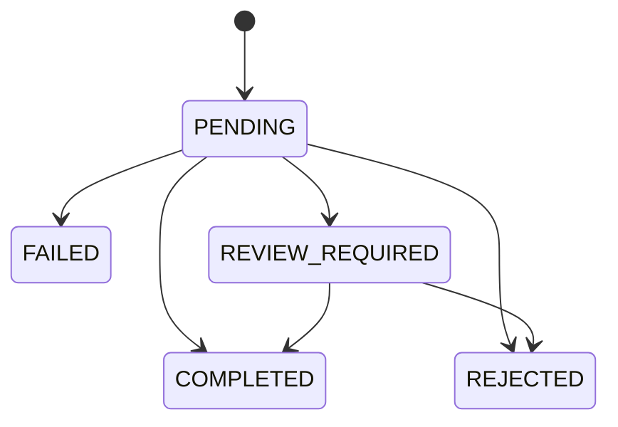
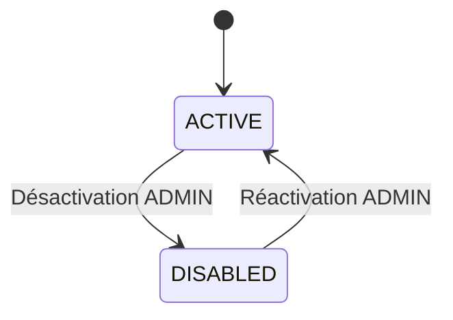
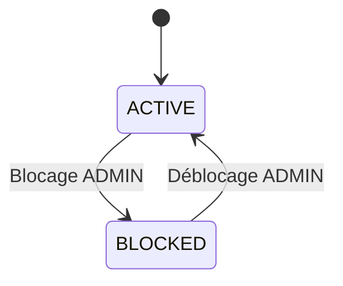
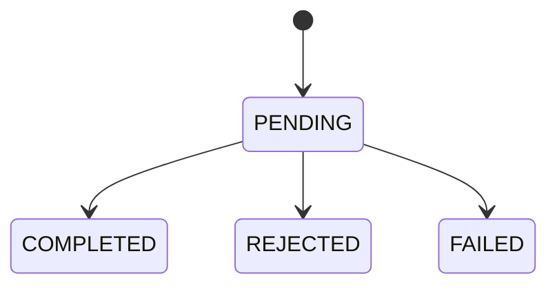

# SecureMicroservicesBank — Règles métier

**Document :** Catalogue des règles métier du MVP  
**Projet :** SecureMicroservicesBank  
**Version :** 1.0  
**Statut :** Brouillon de conception fonctionnelle  
**Documents parents :**
- `docs/project-scope.md`
- `docs/use-cases.md`

**Référence :** Cahier des charges SecureMicroservicesBank, version 1.0 du 19 juin 2026

---

## 1. Objectif du document

Ce document formalise les règles qui gouvernent le comportement fonctionnel et sécuritaire du MVP de SecureMicroservicesBank.

Il sert de référence pour :

- concevoir les entités et les APIs ;
- répartir les responsabilités entre microservices ;
- implémenter la logique métier dans les services ;
- définir les contraintes PostgreSQL ;
- écrire les tests unitaires, d’intégration et de sécurité ;
- vérifier les critères d’acceptation ;
- éviter que des règles importantes soient dispersées dans les contrôleurs ou l’interface React.

Une règle métier décrit ce que le système doit toujours autoriser, refuser, calculer ou enregistrer, indépendamment de l’interface utilisée.

---

## 2. Périmètre

Les règles concernent principalement les services du MVP :

- `api-gateway` ;
- `auth-service` ;
- `customer-service` ;
- `account-service` ;
- `transaction-service` ;
- `audit-service`.

Les règles du `risk-service`, du `notification-service` et du `reporting-service` sont introduites seulement lorsqu’elles influencent déjà le MVP. Elles seront complétées dans une version ultérieure.

---

## 3. Conventions

### 3.1 Niveaux de priorité

| Priorité | Signification |
|---|---|
| `MUST` | Obligatoire pour accepter le MVP |
| `SHOULD` | Fortement recommandé, mais peut être reporté avec justification |
| `MAY` | Optionnel ou prévu pour une évolution |

### 3.2 Catégories de règles

| Préfixe | Domaine |
|---|---|
| `R-GEN` | Règles générales |
| `R-AUTH` | Authentification et identité |
| `R-CUST` | Profils clients |
| `R-ACC` | Comptes bancaires |
| `R-TRX` | Transactions et virements |
| `R-IDEM` | Idempotence |
| `R-AUD` | Audit |
| `R-ADM` | Administration et rôles |
| `R-ERR` | Erreurs et confidentialité |
| `R-DATA` | Données et persistance |

### 3.3 Vocabulaire

- **Utilisateur** : identité technique gérée par `auth-service`.
- **Client** : profil bancaire fictif géré par `customer-service`.
- **Compte bancaire** : ressource gérée par `account-service`.
- **Transaction** : tentative ou exécution d’un virement gérée par `transaction-service`.
- **Propriétaire** : client auquel appartient une ressource.
- **Opération sensible** : action nécessitant une autorisation forte et une trace d’audit.
- **Clé d’idempotence** : identifiant fourni avec une demande de virement afin d’empêcher une double exécution.
- **Correlation ID** : identifiant permettant de suivre une requête à travers plusieurs services.

---

# 4. Règles générales

## R-GEN-01 — Données fictives uniquement

**Priorité :** `MUST`

Le projet ne doit contenir aucune donnée bancaire ou personnelle réelle.

### Conséquences

- Les noms, emails, numéros de téléphone et numéros de compte utilisés en démonstration sont fictifs.
- Aucun numéro de carte ou identifiant bancaire réel ne doit être collecté.
- Les jeux de données de test doivent être clairement identifiés comme données de démonstration.

### Tests attendus

- Vérification manuelle des données de démonstration.
- Contrôle du dépôt avant publication.

---

## R-GEN-02 — Séparation identité/profil bancaire

**Priorité :** `MUST`

L’identité d’authentification et le profil bancaire sont deux concepts différents.

- `auth-service` possède l’utilisateur, son email de connexion, son mot de passe haché, ses rôles et ses sessions.
- `customer-service` possède les informations du profil client.
- `customer-service` ne stocke jamais le mot de passe.
- `auth-service` ne stocke jamais le solde ou les comptes bancaires.

### Exemple

```text
auth_user_id = 70f...
        │
        └── référence logique
              customer_id = a41...
```

La relation entre les deux services est une référence logique et non une clé étrangère PostgreSQL entre deux bases différentes.

---

## R-GEN-03 — Propriété des ressources

**Priorité :** `MUST`

Toute ressource appartenant à un client doit être associée à un identifiant de propriétaire.

Sont concernées :

- le profil client ;
- les comptes bancaires ;
- les transactions visibles par le client.

La vérification de propriété est obligatoire même si l’utilisateur possède déjà le rôle `CLIENT`.

```text
Rôle correct + ressource non possédée = accès refusé
```

---

## R-GEN-04 — Autorité du backend

**Priorité :** `MUST`

Toutes les règles métier et les autorisations doivent être imposées par le backend.

Le frontend peut masquer des actions, mais cette protection est uniquement ergonomique.

### Interdiction

Il est interdit de considérer une action sécurisée uniquement parce que son bouton n’est pas visible dans React.

---

## R-GEN-05 — Identifiants uniques

**Priorité :** `MUST`

Les ressources principales possèdent un identifiant unique non prédictible, de préférence un `UUID`.

Sont concernées :

- utilisateurs ;
- clients ;
- comptes ;
- transactions ;
- refresh tokens ;
- événements d’audit.

---

## R-GEN-06 — Dates de référence

**Priorité :** `MUST`

Les dates techniques doivent être stockées dans un format permettant une représentation non ambiguë du temps.

Recommandation :

- Java : `Instant` ou `OffsetDateTime` ;
- PostgreSQL : `TIMESTAMP WITH TIME ZONE` ;
- API JSON : ISO 8601 en UTC.

Exemple :

```text
2026-07-21T10:30:00Z
```

---

## R-GEN-07 — Correlation ID

**Priorité :** `MUST`

Chaque requête entrant dans le système doit recevoir un `correlationId`.

- La gateway conserve un identifiant valide fourni par le client ou en génère un.
- Cet identifiant est propagé aux appels interservices.
- Il apparaît dans les logs techniques et les événements d’audit.
- Il est retourné dans les erreurs lorsque cela aide au diagnostic.

---

# 5. Règles d’authentification et d’identité

## R-AUTH-01 — Email unique

**Priorité :** `MUST`

Un email de connexion ne peut être associé qu’à un seul utilisateur.

### Normalisation minimale

Avant comparaison :

1. supprimer les espaces extérieurs ;
2. traiter la casse du domaine de manière cohérente ;
3. appliquer une politique stable dans tout le service.

### Réponse attendue en cas de doublon

```text
HTTP 409 Conflict
Code : EMAIL_ALREADY_EXISTS
```

Une contrainte `UNIQUE` doit aussi exister dans PostgreSQL pour protéger la règle contre les accès concurrents.

---

## R-AUTH-02 — Rôle attribué lors de l’inscription publique

**Priorité :** `MUST`

Une inscription publique crée uniquement un utilisateur avec le rôle `CLIENT`.

Le visiteur ne peut jamais choisir dans la requête :

- `ADMIN` ;
- `AUDITOR` ;
- `SECURITY_VIEWER`.

Toute valeur de rôle fournie par le client doit être ignorée ou refusée.

---

## R-AUTH-03 — Mot de passe non stocké en clair

**Priorité :** `MUST`

Le mot de passe doit être transformé avec BCrypt ou Argon2 avant sa persistance.

Il est interdit de stocker :

- le mot de passe en clair ;
- un mot de passe chiffré de manière réversible ;
- le mot de passe dans les logs ;
- le mot de passe dans un événement d’audit.

---

## R-AUTH-04 — Politique de mot de passe

**Priorité :** `MUST`

Le mot de passe doit respecter une politique minimale définie et testée.

### Proposition pour le MVP

- longueur minimale de 12 caractères ;
- au moins une lettre minuscule ;
- au moins une lettre majuscule ;
- au moins un chiffre ;
- au moins un caractère spécial ;
- refus des mots de passe trop communs si une liste de contrôle est disponible.

Cette politique est une décision de conception proposée. Elle pourra être ajustée avant l’implémentation.

---

## R-AUTH-05 — Échec de connexion générique

**Priorité :** `MUST`

Une connexion échouée ne doit pas révéler si l’email existe.

Réponse recommandée :

```text
Email ou mot de passe incorrect.
```

Réponses interdites :

```text
Cet email n’existe pas.
Le mot de passe de cet utilisateur est incorrect.
```

---

## R-AUTH-06 — Blocage temporaire

**Priorité :** `MUST`

Après plusieurs tentatives de connexion échouées, l’utilisateur doit être temporairement bloqué.

### Proposition pour le MVP

- seuil : 5 tentatives échouées ;
- durée initiale : 15 minutes ;
- remise à zéro du compteur après une connexion réussie ;
- événement d’audit lors du blocage.

Les valeurs exactes doivent être configurables et non codées directement dans la logique métier.

---

## R-AUTH-07 — Access token à durée courte

**Priorité :** `MUST`

L’access token possède une durée de vie courte.

Il doit au minimum contenir :

- l’identifiant de l’utilisateur ;
- les rôles ;
- une date d’émission ;
- une date d’expiration ;
- un identifiant de token si nécessaire.

Un token absent, invalide, altéré ou expiré entraîne une réponse `401 Unauthorized`.

---

## R-AUTH-08 — Refresh token contrôlé

**Priorité :** `MUST`

Le refresh token :

- possède une expiration ;
- peut être révoqué ;
- n’est jamais enregistré en clair si une stratégie de hachage est retenue ;
- ne peut pas être utilisé après déconnexion ou révocation ;
- doit être remplacé lors d’une rotation.

La rotation du refresh token est obligatoire dans la cible finale et recommandée dès le MVP.

---

## R-AUTH-09 — Déconnexion

**Priorité :** `MUST`

La déconnexion révoque au minimum le refresh token utilisé par la session.

Un access token déjà émis peut rester techniquement valide jusqu’à son expiration courte, sauf mise en place d’une liste de révocation.

---

## R-AUTH-10 — Audit des authentifications

**Priorité :** `MUST`

Les événements suivants doivent être audités :

- inscription réussie ;
- connexion réussie ;
- connexion échouée ;
- blocage temporaire ;
- rafraîchissement de token ;
- déconnexion ;
- révocation de session.

Aucun token ou mot de passe ne doit apparaître dans la charge d’audit.

---

# 6. Règles relatives aux profils clients

## R-CUST-01 — Un profil par identité

**Priorité :** `MUST`

Un utilisateur de type client ne peut posséder qu’un seul profil client actif dans le MVP.

La référence `authUserId` doit être unique dans la base du `customer-service`.

---

## R-CUST-02 — Consultation de son propre profil

**Priorité :** `MUST`

Un client peut consulter uniquement le profil associé à son identité authentifiée.

L’identifiant du propriétaire est dérivé du contexte d’authentification, et non d’un identifiant fourni librement dans le corps de la requête.

Endpoint recommandé :

```http
GET /api/customers/me
```

---

## R-CUST-03 — Modification limitée du profil

**Priorité :** `MUST`

Le client peut modifier seulement les attributs explicitement autorisés.

### Attributs potentiellement modifiables

- prénom ;
- nom ;
- téléphone ;
- adresse fictive.

### Attributs non modifiables directement

- identifiant ;
- numéro client ;
- rôle ;
- statut administratif ;
- date de création ;
- `authUserId`.

---

## R-CUST-04 — Données sensibles masquées

**Priorité :** `MUST`

Les réponses API ne doivent pas exposer les données techniques ou sensibles inutiles.

Exemples à ne pas exposer :

- informations d’authentification ;
- identifiants internes non nécessaires ;
- données de sécurité ;
- métadonnées techniques de persistance.

---

## R-CUST-05 — Désactivation d’un client

**Priorité :** `MUST`

Seul un administrateur peut désactiver ou réactiver un profil client.

Un client désactivé :

- ne peut pas initier de nouveau virement ;
- ne peut pas créer un nouveau compte ;
- conserve son historique ;
- ne doit pas être supprimé physiquement pour contourner l’audit.

La coordination avec le statut de l’utilisateur dans `auth-service` devra être spécifiée lors de la conception des communications interservices.

---

## R-CUST-06 — Suppression physique interdite dans le MVP

**Priorité :** `MUST`

Aucune API standard ne supprime physiquement un client ayant des comptes ou des transactions.

La désactivation logique est préférée.

---

# 7. Règles relatives aux comptes bancaires

## R-ACC-01 — Propriétaire obligatoire

**Priorité :** `MUST`

Chaque compte bancaire appartient à un seul client.

Le `customerId` est obligatoire lors de la création et reste immuable pendant le MVP.

---

## R-ACC-02 — Numéro de compte unique

**Priorité :** `MUST`

Chaque compte possède un numéro unique généré par le système.

Le numéro ne doit pas être choisi arbitrairement par le client.

Une contrainte `UNIQUE` doit protéger la règle en base.

---

## R-ACC-03 — Solde initial

**Priorité :** `MUST`

Un nouveau compte possède par défaut un solde initial égal à zéro.

```text
balance = 0.00
```

Pour le MVP, aucun utilisateur ni administrateur ne peut fournir librement un solde initial via l’API publique.

Une fonctionnalité de données de démonstration pourra alimenter certains comptes dans un environnement local contrôlé.

---

## R-ACC-04 — Devise

**Priorité :** `MUST`

Chaque compte possède une devise explicite.

### Proposition MVP

- devise initialement prise en charge : `MAD` ;
- extension future possible vers d’autres devises ;
- aucun calcul de conversion dans le MVP.

Une transaction entre deux comptes de devises différentes est refusée tant qu’un service de conversion n’est pas conçu.

---

## R-ACC-05 — Montant représenté avec précision décimale

**Priorité :** `MUST`

Les montants utilisent :

- `BigDecimal` en Java ;
- `NUMERIC(19,2)` ou une précision équivalente en PostgreSQL.

L’utilisation de `float` ou `double` pour le solde et le montant des virements est interdite.

---

## R-ACC-06 — Statuts de compte

**Priorité :** `MUST`

Le MVP utilise au minimum les statuts :

```text
ACTIVE
BLOCKED
```

Évolutions possibles :

```text
CLOSED
SUSPENDED
PENDING_ACTIVATION
```

Un nouveau compte est créé avec le statut `ACTIVE`, sauf politique administrative différente explicitement décidée.

---

## R-ACC-07 — Blocage réservé à l’administrateur

**Priorité :** `MUST`

Seul un utilisateur possédant le rôle `ADMIN` peut bloquer ou débloquer un compte.

Un client ne peut pas changer directement le statut de son compte.

Chaque changement de statut produit un événement d’audit.

---

## R-ACC-08 — Solde non modifiable par l’administrateur

**Priorité :** `MUST`

Un administrateur ne peut jamais définir directement le solde d’un compte via une API d’administration.

Le solde évolue uniquement à travers des opérations métier autorisées et traçables.

Exemples :

- débit dans le cadre d’un virement ;
- crédit dans le cadre d’un virement ;
- opération de démonstration contrôlée et explicitement séparée du périmètre de production simulée.

---

## R-ACC-09 — Compte bloqué inutilisable

**Priorité :** `MUST`

Un compte `BLOCKED` ne peut pas :

- émettre un virement ;
- recevoir un virement dans le MVP ;
- être utilisé par une opération modifiant son solde.

La consultation de son historique reste autorisée à son propriétaire.

La décision de refuser également les crédits sur un compte bloqué est retenue pour simplifier et sécuriser le MVP.

---

## R-ACC-10 — Accès par propriété

**Priorité :** `MUST`

Un client peut consulter uniquement un compte dont le `customerId` correspond à son propre profil.

La connaissance de l’UUID du compte ne donne aucun droit d’accès.

---

## R-ACC-11 — Concurrence sur le solde

**Priorité :** `MUST`

Les mises à jour de solde doivent empêcher la perte de mise à jour lors de transactions concurrentes.

Le mécanisme sera choisi pendant la conception technique :

- verrouillage optimiste avec un champ `version` ;
- verrouillage pessimiste ciblé ;
- commande atomique contrôlée.

Un test de concurrence doit vérifier qu’un compte ne peut pas être débité deux fois au-delà de son solde disponible.

---

## R-ACC-12 — Suppression physique interdite

**Priorité :** `MUST`

Un compte ayant participé à une transaction ne peut pas être supprimé via l’API standard.

Un futur statut `CLOSED` pourra représenter sa fermeture.

---

# 8. Règles relatives aux transactions

## R-TRX-01 — Virement interne uniquement

**Priorité :** `MUST`

Le MVP gère uniquement les virements entre deux comptes internes au système.

Aucune intégration avec une banque réelle ou un système de paiement externe n’est autorisée.

---

## R-TRX-02 — Montant strictement positif

**Priorité :** `MUST`

Le montant du virement doit être :

- non nul ;
- strictement supérieur à zéro ;
- compatible avec la précision monétaire retenue.

Exemples refusés :

```text
0
-100
10.999 si deux décimales maximum sont autorisées
```

---

## R-TRX-03 — Comptes différents

**Priorité :** `MUST`

Le compte source et le compte destination doivent être différents.

Un virement d’un compte vers lui-même est refusé.

Réponse recommandée :

```text
HTTP 400 Bad Request
Code : SAME_SOURCE_AND_DESTINATION
```

---

## R-TRX-04 — Propriété du compte source

**Priorité :** `MUST`

Le client authentifié doit être propriétaire du compte source.

Il n’est pas obligatoire qu’il soit propriétaire du compte destination.

Cette vérification est effectuée côté backend avant toute modification du solde.

---

## R-TRX-05 — Existence des comptes

**Priorité :** `MUST`

Les comptes source et destination doivent exister.

Pour éviter la divulgation d’informations, la réponse publique peut rester générique lorsqu’un client tente d’utiliser une ressource qui ne lui appartient pas.

---

## R-TRX-06 — Comptes actifs

**Priorité :** `MUST`

Les comptes source et destination doivent être `ACTIVE`.

Si l’un d’eux est bloqué, le virement est refusé avant toute modification de solde.

---

## R-TRX-07 — Devise compatible

**Priorité :** `MUST`

Les comptes source et destination doivent posséder la même devise dans le MVP.

Aucune conversion automatique n’est réalisée.

---

## R-TRX-08 — Solde suffisant

**Priorité :** `MUST`

Le solde du compte source doit être supérieur ou égal au montant demandé.

```text
source.balance >= transaction.amount
```

Le solde ne doit jamais devenir négatif à la suite d’un virement accepté.

---

## R-TRX-09 — Identifiant unique

**Priorité :** `MUST`

Chaque transaction possède un identifiant unique généré par le système.

Cet identifiant est différent de la clé d’idempotence.

---

## R-TRX-10 — Statuts de transaction

**Priorité :** `MUST`

Le MVP utilise au minimum les statuts suivants :

```text
PENDING
COMPLETED
REJECTED
FAILED
```

Lorsque le `risk-service` sera intégré :

```text
REVIEW_REQUIRED
```

### Signification

| Statut | Signification |
|---|---|
| `PENDING` | Demande enregistrée, traitement en cours |
| `COMPLETED` | Débit et crédit validés |
| `REJECTED` | Refus métier prévisible |
| `FAILED` | Échec technique ou incohérence nécessitant traitement |
| `REVIEW_REQUIRED` | Analyse supplémentaire nécessaire |

---

## R-TRX-11 — Transitions de statut contrôlées

**Priorité :** `MUST`

Les transitions de statut doivent être explicites.



Dans le premier MVP sans `risk-service`, `REVIEW_REQUIRED` peut ne pas être implémenté.

Une transaction `COMPLETED` ne peut pas redevenir `PENDING`.

---

## R-TRX-12 — Atomicité locale des changements

**Priorité :** `MUST`

Lorsqu’un débit, un crédit et l’enregistrement métier se déroulent dans la même base et le même service, ils doivent être protégés par une transaction SQL.

Dans l’architecture microservices finale, `account-service` et `transaction-service` possèdent des bases séparées. Une transaction SQL unique ne peut donc pas couvrir tout le flux.

La stratégie distribuée sera conçue ultérieurement, avec au minimum :

- états explicites ;
- opérations idempotentes ;
- compensation ou orchestration ;
- audit ;
- gestion des erreurs et reprises.

---

## R-TRX-13 — Aucun double débit

**Priorité :** `MUST`

Une même demande métier ne doit jamais provoquer deux débits.

Cette règle est protégée par :

- la clé d’idempotence ;
- une contrainte d’unicité ;
- un traitement concurrent sûr ;
- des consommateurs idempotents si des événements sont utilisés.

---

## R-TRX-14 — Historique conservé

**Priorité :** `MUST`

Toutes les tentatives de transaction ayant dépassé la validation initiale doivent être conservées avec leur statut final.

Une transaction rejetée ne doit pas être supprimée simplement parce qu’elle n’a pas modifié les soldes.

---

## R-TRX-15 — Consultation par propriété

**Priorité :** `MUST`

Un client peut consulter une transaction si au moins l’un de ses comptes y participe, selon la politique du MVP.

Pour réduire l’exposition, l’API doit retourner uniquement les informations nécessaires.

Un administrateur peut consulter les transactions conformément à ses autorisations, sans pouvoir les modifier.

---

## R-TRX-16 — Audit des transactions

**Priorité :** `MUST`

Les événements suivants doivent être audités :

- demande de virement reçue ;
- virement terminé ;
- virement rejeté ;
- virement en échec ;
- détection d’une réutilisation incorrecte de clé d’idempotence ;
- décision de risque lorsqu’elle sera intégrée.

---

# 9. Règles d’idempotence

## R-IDEM-01 — Clé obligatoire

**Priorité :** `MUST`

Toute demande de virement doit contenir une clé d’idempotence.

Header recommandé :

```http
Idempotency-Key: 6f3d2e6c-...
```

Une demande sans clé est refusée.

Réponse proposée :

```text
HTTP 400 Bad Request
Code : IDEMPOTENCY_KEY_REQUIRED
```

---

## R-IDEM-02 — Unicité par acteur et opération

**Priorité :** `MUST`

La clé doit être unique dans un périmètre défini.

Périmètre recommandé :

```text
utilisateur authentifié + type d’opération + clé d’idempotence
```

Une contrainte d’unicité doit empêcher deux enregistrements concurrents correspondant au même périmètre.

---

## R-IDEM-03 — Même clé et même requête

**Priorité :** `MUST`

Si une clé déjà traitée est réutilisée avec exactement la même requête, le système retourne le résultat initial sans réexécuter le virement.

Le code HTTP peut être le même que lors du traitement initial.

La réponse doit permettre d’identifier qu’il s’agit du même résultat métier.

---

## R-IDEM-04 — Même clé et contenu différent

**Priorité :** `MUST`

Si la même clé est réutilisée avec un contenu métier différent, la demande est refusée.

Exemple :

```text
Première demande : 100 MAD vers compte B
Deuxième demande : 500 MAD vers compte C
Même clé
```

Réponse recommandée :

```text
HTTP 409 Conflict
Code : IDEMPOTENCY_KEY_REUSED
```

---

## R-IDEM-05 — Empreinte de requête

**Priorité :** `SHOULD`

Le système conserve une empreinte déterministe des champs métier pertinents :

- compte source ;
- compte destination ;
- montant ;
- devise ;
- utilisateur.

Cette empreinte permet de vérifier que la requête répétée est réellement identique.

---

## R-IDEM-06 — Traitement concurrent

**Priorité :** `MUST`

Deux requêtes simultanées utilisant la même clé ne doivent pas exécuter deux virements.

Une seule requête obtient le droit de traiter l’opération ; l’autre récupère le résultat existant ou attend l’achèvement selon la stratégie retenue.

---

## R-IDEM-07 — Durée de conservation

**Priorité :** `SHOULD`

Les données d’idempotence doivent être conservées assez longtemps pour empêcher les répétitions accidentelles.

Pour le projet pédagogique, elles peuvent être conservées pendant toute la durée de la démonstration.

Une politique d’expiration pourra être définie ultérieurement.

---

# 10. Règles d’audit

## R-AUD-01 — Opérations sensibles obligatoirement auditées

**Priorité :** `MUST`

Au minimum, les opérations suivantes génèrent un événement :

- inscription ;
- connexion réussie ou échouée ;
- blocage de compte utilisateur ;
- refresh et révocation de session ;
- création ou désactivation d’un profil client ;
- création, blocage ou déblocage d’un compte bancaire ;
- consultation administrative sensible ;
- virement terminé, rejeté ou échoué ;
- tentative d’accès interdite significative ;
- changement de rôle.

---

## R-AUD-02 — Structure minimale

**Priorité :** `MUST`

Un événement d’audit contient au minimum :

```text
eventId
eventType
occurredAt
actorId
actorRole
action
resourceType
resourceId
result
severity
correlationId
sourceService
```

Champs complémentaires possibles :

```text
ipAddress
userAgent
metadata
failureReasonCode
```

---

## R-AUD-03 — Absence de secrets

**Priorité :** `MUST`

Un événement d’audit ne contient jamais :

- mot de passe ;
- hash de mot de passe ;
- access token ;
- refresh token ;
- clé privée ;
- secret d’application ;
- chaîne de connexion complète contenant un mot de passe.

---

## R-AUD-04 — Immutabilité fonctionnelle

**Priorité :** `MUST`

Les APIs standards de l’`audit-service` ne permettent ni modification ni suppression d’un événement.

Endpoints interdits dans le MVP :

```http
PUT /api/audit-events/{id}
PATCH /api/audit-events/{id}
DELETE /api/audit-events/{id}
```

---

## R-AUD-05 — Accès restreint

**Priorité :** `MUST`

Seuls les rôles autorisés peuvent consulter les audits globaux :

- `AUDITOR` ;
- `ADMIN` selon le périmètre défini ;
- éventuellement `SECURITY_VIEWER`.

Un client ne peut pas consulter le journal global.

---

## R-AUD-06 — Recherche

**Priorité :** `MUST`

Les événements peuvent être filtrés au minimum par :

- acteur ;
- action ;
- type de ressource ;
- date ;
- sévérité ;
- résultat ;
- correlation ID.

Les résultats sont paginés.

---

## R-AUD-07 — Échec d’audit

**Priorité :** `SHOULD`

L’échec temporaire de l’`audit-service` ne doit pas entraîner silencieusement la perte d’un événement critique.

La stratégie cible doit prévoir :

- retry ;
- file de messages ;
- dead-letter queue ;
- mécanisme de reprise.

Pour le premier incrément, tout échec doit au minimum être visible dans les logs et les tests.

---

## R-AUD-08 — Horodatage côté serveur

**Priorité :** `MUST`

L’heure officielle de l’événement est générée par le système, et non acceptée comme vérité depuis le frontend.

---

# 11. Règles d’administration et de rôles

## R-ADM-01 — Principe du moindre privilège

**Priorité :** `MUST`

Chaque rôle dispose uniquement des permissions nécessaires.

| Action | CLIENT | ADMIN | AUDITOR |
|---|---:|---:|---:|
| Consulter son profil | Oui | Selon besoin | Non |
| Modifier son profil | Oui | Selon besoin | Non |
| Consulter ses comptes | Oui | Selon périmètre | Non |
| Effectuer un virement | Oui | Non par défaut | Non |
| Bloquer un compte | Non | Oui | Non |
| Modifier directement un solde | Non | Non | Non |
| Consulter les audits globaux | Non | Oui, limité | Oui |
| Modifier un audit | Non | Non | Non |

---

## R-ADM-02 — Aucun rôle choisi par le client

**Priorité :** `MUST`

Un client ne peut pas modifier son propre rôle.

Toute modification de rôle est :

- réservée à une opération administrative contrôlée ;
- auditée ;
- protégée par une autorisation forte.

---

## R-ADM-03 — Blocage de compte sans modification de solde

**Priorité :** `MUST`

L’action de bloquer ou débloquer un compte ne modifie jamais son solde.

---

## R-ADM-04 — Actions administratives auditées

**Priorité :** `MUST`

Toute action administrative critique génère un événement d’audit contenant :

- l’administrateur ;
- la ressource ciblée ;
- l’ancienne valeur lorsque pertinente ;
- la nouvelle valeur ;
- le résultat ;
- le correlation ID.

---

## R-ADM-05 — Auditeur en lecture seule

**Priorité :** `MUST`

Le rôle `AUDITOR` est strictement en lecture seule pour les données bancaires et les journaux d’audit.

---

# 12. Règles d’erreur et de confidentialité

## R-ERR-01 — Erreur publique générique

**Priorité :** `MUST`

Les réponses publiques ne révèlent pas :

- stack trace ;
- classe Java ;
- requête SQL ;
- nom de table ;
- mot de passe ;
- secret ;
- token ;
- adresse interne d’un service ;
- détail exploitable sur l’infrastructure.

---

## R-ERR-02 — Format d’erreur stable

**Priorité :** `MUST`

Les erreurs suivent un format commun.

Exemple :

```json
{
  "timestamp": "2026-07-21T10:30:00Z",
  "status": 409,
  "code": "INSUFFICIENT_BALANCE",
  "message": "The transfer cannot be completed",
  "path": "/api/transfers",
  "correlationId": "req-123"
}
```

Le champ `code` est stable et exploitable par le frontend.

---

## R-ERR-03 — Différence entre authentification et autorisation

**Priorité :** `MUST`

- token absent, invalide ou expiré : `401 Unauthorized` ;
- utilisateur authentifié sans permission : `403 Forbidden` ;
- ressource inexistante : `404 Not Found` ;
- `404` peut être utilisé pour éviter de confirmer l’existence d’une ressource appartenant à un autre client.

---

## R-ERR-04 — Validation des entrées

**Priorité :** `MUST`

Toute entrée est contrôlée :

- format ;
- longueur ;
- présence ;
- plage ;
- cohérence métier ;
- appartenance à une liste de valeurs autorisées.

La validation des DTO ne remplace pas les règles métier du service.

---

## R-ERR-05 — Pas de données sensibles dans les logs

**Priorité :** `MUST`

Les logs techniques ne doivent jamais contenir :

- mot de passe ;
- token complet ;
- secret ;
- données personnelles inutiles ;
- payload bancaire complet lorsque ce n’est pas nécessaire.

---

# 13. Règles de données et de persistance

## R-DATA-01 — Une base logique par service

**Priorité :** `MUST` pour la cible microservices

Chaque service possède ses propres données.

Un service ne lit ni ne modifie directement les tables d’un autre service.

```text
transaction-service
    └── appelle account-service
        └── account-service accède à account_db
```

---

## R-DATA-02 — Contraintes en base

**Priorité :** `MUST`

Les invariants simples doivent être protégés à la fois par le code et par PostgreSQL lorsque c’est possible.

Exemples :

- email unique ;
- numéro de compte unique ;
- clé d’idempotence unique dans son périmètre ;
- champs obligatoires `NOT NULL` ;
- montants avec précision fixe ;
- valeurs de statut contrôlées.

---

## R-DATA-03 — Migrations versionnées

**Priorité :** `MUST`

Toute modification de schéma est réalisée avec des migrations versionnées, par exemple Flyway.

Exemple :

```text
V1__create_users.sql
V2__create_refresh_tokens.sql
V3__add_unique_email_constraint.sql
```

Les modifications manuelles non tracées en base sont interdites dans les environnements partagés.

---

## R-DATA-04 — Historique non détruit

**Priorité :** `MUST`

Les transactions et événements d’audit sont conservés.

La désactivation ou le changement de statut est préféré à la suppression physique pour les ressources historiques.

---

## R-DATA-05 — Pagination

**Priorité :** `MUST`

Les endpoints retournant des collections potentiellement longues sont paginés :

- clients ;
- comptes ;
- transactions ;
- audits.

Une taille maximale doit empêcher une extraction non bornée.

---

# 14. Matrices de transitions

## 14.1 Statut d’un client



## 14.2 Statut d’un compte



## 14.3 Statut d’une transaction



`REVIEW_REQUIRED` sera ajouté avec le `risk-service`.

---

# 15. Ordre de validation d’un virement

Le `transaction-service` doit valider la demande dans un ordre cohérent afin de réduire les traitements inutiles et les risques d’information divulguée.

Ordre recommandé :

```text
1. Authentifier l’utilisateur
2. Vérifier le rôle CLIENT
3. Valider le format de la requête
4. Vérifier la présence de la clé d’idempotence
5. Chercher une opération existante avec cette clé
6. Vérifier que source ≠ destination
7. Vérifier la propriété du compte source
8. Vérifier l’existence des comptes
9. Vérifier le statut des deux comptes
10. Vérifier la compatibilité des devises
11. Vérifier le solde disponible
12. Appeler le contrôle de risque lorsqu’il existe
13. Exécuter l’opération avec protection contre la concurrence
14. Enregistrer le statut final
15. Produire l’événement d’audit
16. Retourner la réponse
```

Cet ordre pourra évoluer lors de la conception du protocole distribué, mais les invariants métier restent obligatoires.

---

# 16. Traçabilité règles — cas d’utilisation

| Règle | Cas d’utilisation principaux |
|---|---|
| `R-AUTH-01` à `R-AUTH-04` | `UC-AUTH-01` |
| `R-AUTH-05` à `R-AUTH-07` | `UC-AUTH-02` |
| `R-AUTH-08` | `UC-AUTH-03` |
| `R-AUTH-09` | `UC-AUTH-04` |
| `R-CUST-01` | `UC-CUST-01` |
| `R-CUST-02` | `UC-CUST-02` |
| `R-CUST-03` | `UC-CUST-03` |
| `R-CUST-05` | `UC-CUST-04` |
| `R-ACC-01` à `R-ACC-06` | `UC-ACC-01` |
| `R-ACC-10` | `UC-ACC-02`, `UC-ACC-03` |
| `R-ACC-07`, `R-ACC-09` | `UC-ACC-04`, `UC-ACC-05` |
| `R-TRX-01` à `R-TRX-16` | `UC-TRX-01`, `UC-TRX-02`, `UC-TRX-03` |
| `R-IDEM-01` à `R-IDEM-07` | `UC-TRX-01` |
| `R-AUD-01` à `R-AUD-08` | `UC-AUD-01`, `UC-AUD-02`, `UC-AUD-03` |
| `R-ADM-01` à `R-ADM-05` | Cas administratifs et audit |
| `R-ERR-01` à `R-ERR-05` | Tous les cas |
| `R-DATA-01` à `R-DATA-05` | Tous les services |

---

# 17. Exemples de tests dérivés des règles

## 17.1 Authentification

```text
AUTH-TEST-01 : une inscription avec un email déjà utilisé retourne 409.
AUTH-TEST-02 : le mot de passe n’est jamais stocké en clair.
AUTH-TEST-03 : une inscription publique ne peut pas créer un ADMIN.
AUTH-TEST-04 : après le seuil configuré, le compte est temporairement bloqué.
AUTH-TEST-05 : une erreur de connexion ne révèle pas si l’email existe.
```

## 17.2 Profils clients

```text
CUST-TEST-01 : un client A ne peut pas consulter le profil de B.
CUST-TEST-02 : un client ne peut pas changer son propre statut.
CUST-TEST-03 : désactiver un client conserve son historique.
```

## 17.3 Comptes

```text
ACC-TEST-01 : un nouveau compte possède un solde nul.
ACC-TEST-02 : deux comptes ne peuvent pas avoir le même numéro.
ACC-TEST-03 : un CLIENT ne peut pas bloquer un compte.
ACC-TEST-04 : un ADMIN ne peut pas modifier directement le solde.
ACC-TEST-05 : un client A ne peut pas consulter le compte de B.
ACC-TEST-06 : un compte bloqué ne peut pas être utilisé.
```

## 17.4 Transactions

```text
TRX-TEST-01 : un montant négatif est refusé.
TRX-TEST-02 : un montant nul est refusé.
TRX-TEST-03 : source et destination identiques sont refusées.
TRX-TEST-04 : un compte source non possédé est refusé.
TRX-TEST-05 : un solde insuffisant empêche tout débit.
TRX-TEST-06 : un compte bloqué empêche le virement.
TRX-TEST-07 : deux devises différentes sont refusées.
TRX-TEST-08 : une transaction terminée apparaît dans l’historique.
TRX-TEST-09 : une transaction rejetée reste traçable.
```

## 17.5 Idempotence et concurrence

```text
IDEM-TEST-01 : absence de clé = 400.
IDEM-TEST-02 : même clé + même requête = même résultat, un seul débit.
IDEM-TEST-03 : même clé + contenu différent = 409.
IDEM-TEST-04 : deux requêtes concurrentes identiques = un seul virement.
CONC-TEST-01 : deux débits concurrents ne rendent pas le solde négatif.
```

## 17.6 Audit

```text
AUD-TEST-01 : une connexion échouée crée un événement.
AUD-TEST-02 : un blocage de compte crée un événement.
AUD-TEST-03 : un virement rejeté crée un événement.
AUD-TEST-04 : un AUDITOR ne peut pas modifier un événement.
AUD-TEST-05 : un CLIENT ne peut pas consulter le journal global.
AUD-TEST-06 : aucun token ou mot de passe n’apparaît dans l’audit.
```

---

# 18. Décisions proposées à valider

Les décisions suivantes sont recommandées pour garder le MVP réalisable :

| Décision | Proposition |
|---|---|
| Créateur initial d’un compte bancaire | `ADMIN` ou processus système contrôlé |
| Solde initial | `0.00` |
| Devise initiale | `MAD` |
| Conversion de devise | Hors MVP |
| Crédit sur compte bloqué | Refusé dans le MVP |
| Suppression physique client/compte | Interdite |
| Nombre maximal d’échecs de connexion | 5, configurable |
| Durée de blocage | 15 minutes, configurable |
| Clé d’idempotence | Header obligatoire |
| Audit | Événements immuables en lecture seule |
| Gestion du risque | Ajoutée après le flux de virement principal |

Ces éléments sont des décisions de conception du projet et non des obligations bancaires réelles.

---

# 19. Critères de validation du document

Le document est validé lorsque les points suivants sont acceptés :

- les rôles et leurs permissions sont clairs ;
- la propriété des ressources est définie ;
- les états des clients, comptes et transactions sont définis ;
- les validations d’un virement sont ordonnées ;
- l’idempotence est spécifiée ;
- les opérations d’audit obligatoires sont listées ;
- les suppressions interdites sont identifiées ;
- les décisions proposées pour le MVP sont confirmées ou corrigées ;
- chaque règle critique peut être transformée en test.

---

# 20. Prochaine étape

Après validation de ces règles, le document suivant sera :

```text
docs/architecture/service-responsibilities.md
```

Il précisera pour chaque microservice :

- ce qu’il possède ;
- ce qu’il expose ;
- ce qu’il consomme ;
- ce qu’il ne doit pas faire ;
- ses dépendances ;
- ses événements ;
- ses frontières fonctionnelles et techniques.
