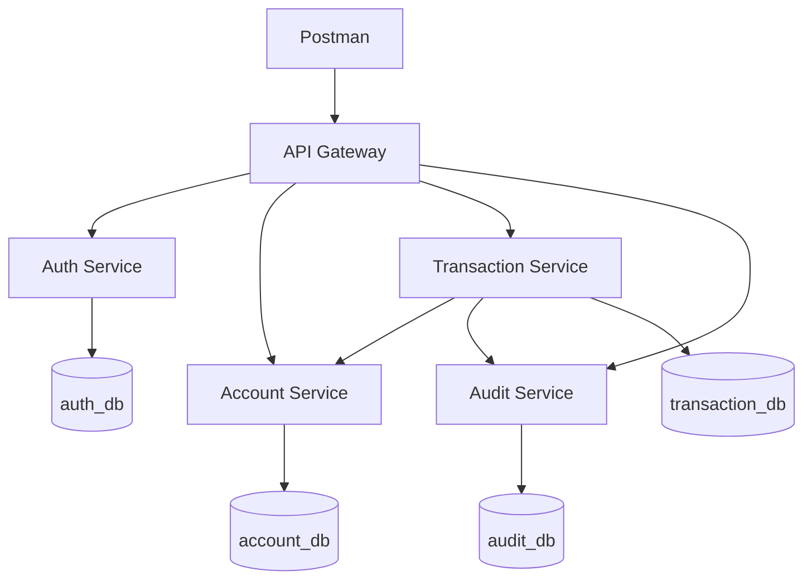

# Scénario de démonstration — SecureMicroservicesBank

## 1. Objectif

Cette démonstration valide le fonctionnement du MVP backend de SecureMicroservicesBank :

- démarrage complet avec Docker Compose ;
- accès unique par l’API Gateway ;
- authentification JWT ;
- gestion des comptes ;
- transfert idempotent ;
- communication entre microservices ;
- audit des opérations ;
- rotation et révocation des refresh tokens.

Durée recommandée : **8 à 10 minutes**.

## 2. Architecture démontrée



Toutes les requêtes externes utilisent :

```text
http://localhost:8080
```

Les ports internes des microservices ne sont pas publiés sur la machine hôte.

## 3. Préparation avant la soutenance

### Vérifier les conteneurs

Démarrer l’environnement avant l’arrivée du jury :

```powershell
docker compose up -d
docker compose ps
```

Tous les conteneurs doivent être `healthy`.

Ne lancez pas la construction des images pendant la démonstration, sauf si le jury le demande.

### Vérifier la Gateway

```powershell
Invoke-RestMethod `
    http://localhost:8080/actuator/health
```

Résultat attendu :

```json
{
  "status": "UP"
}
```

### Préparer Postman

Activer l’environnement :

```text
SecureBank Local
```

Variables nécessaires :

```text
baseUrl
clientEmail
clientPassword
accessToken
refreshToken
oldRefreshToken
sourceAccountId
destinationAccountId
transferId
idempotencyKey
auditorEmail
auditorPassword
auditorAccessToken
```

Utiliser uniquement des utilisateurs fictifs.

Pour chaque nouvelle démonstration, modifier les adresses e-mail afin d’éviter un conflit d’inscription.

Exemple :

```text
demo.client.01@example.com
demo.auditor.01@example.com
```

## 4. Déroulement de la démonstration

### Étape 1 — Présenter l’architecture

Durée : 45 secondes.

Afficher le diagramme d’architecture du README.

Explication proposée :

> L’application est composée de cinq microservices. L’API Gateway représente le point d’entrée unique. Chaque service possède une responsabilité métier claire et une base logique PostgreSQL distincte. Les contrôles de sécurité ne sont pas appliqués uniquement dans la Gateway : chaque service valide également les JWT et les autorisations.

### Étape 2 — Montrer l’environnement Docker

Durée : 30 secondes.

Exécuter :

```powershell
docker compose ps
```

Montrer que les six conteneurs sont `healthy` :

- PostgreSQL ;
- Auth Service ;
- Account Service ;
- Transaction Service ;
- Audit Service ;
- API Gateway.

Explication proposée :

> Chaque application est construite avec un Dockerfile multi-stage. Maven et le JDK sont utilisés uniquement pendant la construction. L’image finale contient seulement le JRE et l’application. Les services sont exécutés avec un utilisateur non-root.

### Étape 3 — Inscrire le client

Durée : 30 secondes.

Requête :

```http
POST {{baseUrl}}/api/v1/auth/register
```

Body :

```json
{
  "email": "{{clientEmail}}",
  "password": "{{clientPassword}}"
}
```

Résultat attendu :

```text
201 Created
role = CLIENT
enabled = true
```

Explication proposée :

> Auth Service normalise l’adresse e-mail, vérifie son unicité, valide le mot de passe puis le stocke sous forme de hash BCrypt.

### Étape 4 — Connexion et vérification du JWT

Durée : 45 secondes.

Exécuter :

```http
POST {{baseUrl}}/api/v1/auth/login
```

Puis :

```http
GET {{baseUrl}}/api/v1/auth/me
Authorization: Bearer {{accessToken}}
```

Résultat attendu :

```text
200 OK
```

Explication proposée :

> La connexion fournit un access token JWT signé avec la clé privée RSA ainsi qu’un refresh token opaque. Les autres services vérifient la signature avec la clé publique, sans avoir accès à la clé privée.

Ne laissez pas les tokens complets visibles pendant la présentation.

### Étape 5 — Afficher les comptes

Durée : 45 secondes.

Exécuter :

```http
GET {{baseUrl}}/api/v1/accounts
Authorization: Bearer {{accessToken}}
```

Montrer :

- le compte source ;
- le compte destination ;
- le solde initial fictif du compte source ;
- le propriétaire commun des comptes.

Le solde doit être préparé avant la démonstration, car les dépôts bancaires sont hors du MVP.

Explication proposée :

> Account Service possède exclusivement les comptes et les soldes. L’identifiant du propriétaire est extrait du claim `sub` du JWT. Un client ne peut pas consulter les comptes d’un autre utilisateur.

### Étape 6 — Effectuer un transfert

Durée : 1 minute.

Requête :

```http
POST {{baseUrl}}/api/v1/transfers
Authorization: Bearer {{accessToken}}
Idempotency-Key: {{idempotencyKey}}
Content-Type: application/json
```

Body :

```json
{
  "sourceAccountId": "{{sourceAccountId}}",
  "destinationAccountId": "{{destinationAccountId}}",
  "amount": 125.50
}
```

Résultat attendu :

```text
201 Created
status = COMPLETED
currency = MAD
```

Explication proposée :

> Transaction Service enregistre le transfert, puis appelle Account Service. Account Service effectue le débit et le crédit dans une transaction locale atomique. Transaction Service envoie ensuite un événement à Audit Service.

### Étape 7 — Démontrer l’idempotence

Durée : 45 secondes.

Renvoyer exactement la même requête avec :

- le même body ;
- la même valeur `Idempotency-Key`.

Résultat attendu :

```text
Le même transferId est retourné.
```

Explication proposée :

> La clé d’idempotence associe la requête à son résultat initial. Si le client répète la requête à cause d’un problème réseau, le transfert n’est pas exécuté une deuxième fois.

### Étape 8 — Vérifier les soldes

Durée : 30 secondes.

Exécuter :

```http
GET {{baseUrl}}/api/v1/accounts
Authorization: Bearer {{accessToken}}
```

Pour un solde initial de `1000.00 MAD` et un transfert de `125.50 MAD` :

```text
Compte source      : 874.50 MAD
Compte destination : 125.50 MAD
```

Cette vérification prouve que le rejeu idempotent n’a pas causé de second débit.

### Étape 9 — Montrer l’audit

Durée : 45 secondes.

Avec le JWT d’un utilisateur `AUDITOR` :

```http
GET {{baseUrl}}/api/v1/audit-events?action=TRANSFER_COMPLETED&sourceService=transaction-service
Authorization: Bearer {{auditorAccessToken}}
```

Montrer l’événement correspondant au `transferId`.

Résultat attendu :

```text
action = TRANSFER_COMPLETED
result = SUCCESS
severity = INFO
sourceService = transaction-service
```

Explication proposée :

> Audit Service conserve une trace immuable de l’opération. La consultation est réservée aux rôles ADMIN et AUDITOR.

### Étape 10 — Démontrer la rotation

Durée : 1 minute.

Utiliser le refresh token courant :

```http
POST {{baseUrl}}/api/v1/auth/refresh
```

Body :

```json
{
  "refreshToken": "{{refreshToken}}"
}
```

Résultat attendu :

```text
200 OK
Nouveau refresh token différent de l’ancien
```

Renvoyer ensuite l’ancien token :

```json
{
  "refreshToken": "{{oldRefreshToken}}"
}
```

Résultat attendu :

```text
401 Unauthorized
```

Explication proposée :

> Un refresh token ne peut être utilisé qu’une seule fois. Une seconde utilisation est considérée comme une tentative de rejeu et entraîne la révocation de toute sa famille.

### Étape 11 — Démontrer le logout

Durée : 30 secondes.

Créer d’abord une nouvelle session, puis exécuter :

```http
POST {{baseUrl}}/api/v1/auth/logout
```

Body :

```json
{
  "refreshToken": "{{refreshToken}}"
}
```

Résultat attendu :

```text
204 No Content
```

Tenter ensuite un refresh avec le même token.

Résultat attendu :

```text
401 Unauthorized
```

Explication proposée :

> Le logout révoque la session de renouvellement. L’access token déjà émis reste valide jusqu’à sa courte expiration, car il est stateless.

## 5. Conclusion orale

Durée : 30 secondes.

Conclusion proposée :

> Ce MVP valide un flux bancaire sécurisé de bout en bout : authentification, autorisation, propriété des comptes, transfert atomique, idempotence, audit et rotation des tokens. L’environnement complet est reproductible avec Docker Compose. Les fonctionnalités plus larges comme Kubernetes, le messaging, le frontend et l’observabilité avancée sont conservées comme perspectives d’évolution.

## 6. Concepts à savoir expliquer

### Pourquoi une API Gateway ?

Elle fournit un point d’entrée stable et masque les adresses internes des microservices.

### Pourquoi chaque service vérifie-t-il le JWT ?

Une requête interne ne doit pas devenir automatiquement fiable. Chaque service protège ses propres ressources.

### Pourquoi une base par service ?

Chaque microservice reste propriétaire de ses données et peut évoluer sans dépendre directement du schéma d’un autre service.

### Pourquoi l’idempotence ?

Elle empêche un double débit lorsque la même requête est répétée.

### Pourquoi un refresh token opaque ?

Il peut être haché, révoqué, consommé et rattaché à une famille côté serveur.

### Pourquoi la rotation ?

Chaque utilisation invalide l’ancien refresh token. Sa réutilisation permet de détecter un possible vol.

### Pourquoi un audit séparé ?

L’audit conserve une traçabilité indépendante des opérations critiques.

### Pourquoi un Dockerfile multi-stage ?

Les outils de compilation restent dans l’étape de build. L’image d’exécution est plus petite et possède une surface d’attaque réduite.

## 7. Plan de secours

Avant la soutenance, conserver :

- les captures du test fonctionnel ;
- une capture de `docker compose ps` ;
- les réponses importantes de Postman ;
- une copie locale de la collection Postman ;
- une copie locale du dépôt ;
- les images Docker déjà construites.

En cas d’échec pendant la démonstration :

1. ne pas supprimer le volume PostgreSQL ;
2. vérifier `docker compose ps` ;
3. afficher les logs du service concerné ;
4. utiliser les captures validées si le problème ne peut pas être corrigé rapidement.

Commande de diagnostic :

```powershell
docker compose logs --tail=100 <nom-du-service>
```

Ne jamais exécuter pendant la soutenance :

```powershell
docker compose down -v
```

Cette commande supprimerait les données locales.
