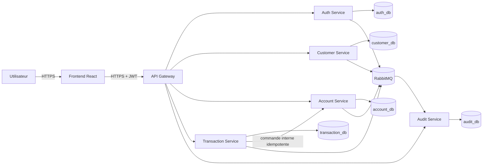

# SecureMicroservicesBank — Modèle de menace initial

**Document :** Threat model initial du MVP  
**Projet :** SecureMicroservicesBank  
**Version :** 1.0  
**Statut :** Proposition à valider

**Documents liés :**
- `docs/project-scope.md`
- `docs/use-cases.md`
- `docs/business-rules.md`
- `docs/architecture/service-responsibilities.md`
- `docs/architecture/data-ownership.md`

---

## 1. Objectif

Ce document identifie les menaces principales du MVP avant l’implémentation. Il sert à :

- repérer les actifs critiques ;
- identifier les points d’entrée et frontières de confiance ;
- analyser les risques avec STRIDE ;
- prioriser les contrôles de sécurité ;
- transformer les menaces importantes en exigences et tests ;
- documenter les risques reportés.

Le modèle devra être mis à jour lorsqu’un service, un flux, un rôle ou une infrastructure change.

---

## 2. Périmètre

Le modèle couvre :

```text
Frontend React
API Gateway
Auth Service
Customer Service
Account Service
Transaction Service
Audit Service
PostgreSQL par service
RabbitMQ
GitHub Actions
Docker
```

Les composants suivants seront approfondis plus tard :

```text
Risk Service
Notification Service
Reporting Service
Kubernetes
Prometheus / Grafana / Loki
Falco
```

---

## 3. Méthode STRIDE

| Catégorie | Question |
|---|---|
| Spoofing | Une identité peut-elle être usurpée ? |
| Tampering | Une donnée ou un message peut-il être modifié ? |
| Repudiation | Un acteur peut-il nier une action ? |
| Information Disclosure | Une donnée sensible peut-elle être exposée ? |
| Denial of Service | Un service peut-il être rendu indisponible ? |
| Elevation of Privilege | Un acteur peut-il obtenir plus de droits ? |

Évaluation utilisée :

- probabilité : faible, moyenne ou élevée ;
- impact : faible, moyen, élevé ou critique ;
- priorité : faible, moyenne, haute ou critique.

---

## 4. Actifs à protéger

| Actif | Propriétaire | Criticité |
|---|---|---:|
| Mots de passe hachés | `auth-service` | Critique |
| Clés JWT et secrets | Plateforme | Critique |
| Refresh tokens | `auth-service` | Critique |
| Rôles et permissions | `auth-service` | Critique |
| Solde des comptes | `account-service` | Critique |
| Intégrité des virements | `account-service` / `transaction-service` | Critique |
| Clés d’idempotence | `transaction-service` | Élevée |
| Profils clients fictifs | `customer-service` | Élevée |
| Journal d’audit | `audit-service` | Élevée |
| Workflows CI/CD | GitHub | Critique |
| Images Docker | Registry | Élevée |
| Secrets PostgreSQL/RabbitMQ | Plateforme | Critique |

---

## 5. Acteurs de menace

- attaquant externe ;
- client malveillant ;
- compte utilisateur compromis ;
- administrateur malveillant ;
- développeur commettant accidentellement un secret ;
- dépendance logicielle compromise ;
- microservice compromis ;
- bot de brute force ou de déni de service.

---

## 6. Points d’entrée

```text
Frontend React
/api/auth/**
/api/customers/**
/api/accounts/**
/api/transfers/**
/api/transactions/**
/api/audit-events/**
Endpoints internes interservices
RabbitMQ
PostgreSQL
GitHub Actions
Registry Docker
Actuator et monitoring
```

Tout point d’entrée doit être explicitement autorisé. Le comportement par défaut doit être le refus.

---

## 7. Frontières de confiance

### 7.1 Navigateur vers frontend

Le navigateur est non fiable. Un utilisateur peut modifier le JavaScript, les requêtes, les headers et les identifiants.

**Conséquence :** le frontend ne constitue jamais une barrière de sécurité.

### 7.2 Internet vers API Gateway

La gateway reçoit des requêtes malveillantes potentielles.

Contrôles :

- TLS ;
- validation JWT ;
- CORS explicite ;
- rate limiting ;
- limites de taille ;
- timeouts ;
- correlation ID ;
- réponses génériques.

### 7.3 Gateway vers services

Un service ne doit pas faire confiance uniquement à la gateway. Il vérifie encore :

- identité ;
- rôle ;
- propriété ;
- règles métier ;
- validité du payload.

### 7.4 Service vers service

Une requête interne peut être falsifiée, rejouée ou envoyée par un service compromis.

Contrôles :

- authentification service-à-service ;
- endpoint interne non exposé ;
- NetworkPolicy plus tard ;
- validation ;
- idempotence ;
- timeouts.

### 7.5 Service vers PostgreSQL

Chaque service utilise une base, un utilisateur et un secret distincts avec les droits minimaux.

### 7.6 Producteur vers RabbitMQ

Un événement peut être dupliqué, malformé ou malveillant.

Contrôles :

- compte RabbitMQ par service ;
- permissions par exchange/queue ;
- schéma versionné ;
- consommateur idempotent ;
- limite de taille ;
- DLQ.

### 7.7 Pipeline vers registry/Kubernetes

La chaîne de livraison est une frontière critique.

Contrôles :

- permissions minimales ;
- branch protection ;
- scans ;
- SBOM ;
- signature d’images ;
- approbation des environnements.

---

## 8. Diagramme de flux simplifié



---

# 9. Analyse STRIDE par composant

## 9.1 Frontend React

### Spoofing
**Menace :** vol d’un access token via XSS ou stockage non sûr.  
**Mesures :** access token court, CSP, protection XSS, nettoyage à la déconnexion, aucun token dans les logs.

### Tampering
**Menace :** modification du body ou d’un identifiant de compte.  
**Mesures :** validation et ownership côté backend.

### Repudiation
**Menace :** le client nie un virement.  
**Mesures :** audit, identité, correlation ID, horodatage serveur, MFA futur.

### Information Disclosure
**Menace :** conservation excessive de données.  
**Mesures :** réponses minimales, masquage, aucun secret côté navigateur.

### Denial of Service
**Menace :** soumissions répétées ou bot.  
**Mesures :** rate limiting, pagination, limite de payload, désactivation du double clic.

### Elevation of Privilege
**Menace :** affichage forcé d’une fonction admin.  
**Mesure :** toutes les autorisations sont imposées par le backend.

---

## 9.2 API Gateway

### Spoofing
JWT falsifié, expiré ou signé avec un algorithme inattendu.

**Mesures :**
- validation de la signature ;
- validation de `exp`, `iss` et `aud` ;
- algorithmes autorisés explicitement ;
- rotation des clés.

### Tampering
Header interne falsifié, par exemple `X-User-Role: ADMIN`.

**Mesures :**
- supprimer les headers d’identité fournis par le client ;
- reconstruire l’identité à partir du JWT.

### Repudiation
Absence de traçabilité.

**Mesures :**
- correlation ID ;
- route, acteur et résultat dans les logs structurés.

### Information Disclosure
Erreur contenant le nom d’un pod ou une stack trace.

**Mesures :**
- erreurs publiques génériques ;
- détails uniquement dans les logs internes.

### Denial of Service
Brute force ou saturation des routes.

**Mesures :**
- rate limiting par IP/utilisateur ;
- timeout ;
- quotas ;
- limites de taille.

### Elevation of Privilege
Route admin accidentellement publique.

**Mesures :**
- deny-by-default ;
- tests automatiques ;
- contrôle répété dans le service métier.

---

## 9.3 Auth Service

### Menaces principales

- brute force ;
- credential stuffing ;
- création frauduleuse d’un rôle `ADMIN` ;
- vol ou rejeu d’un refresh token ;
- fuite du hash du mot de passe ;
- modification non autorisée d’un rôle.

### Mesures

- BCrypt ou Argon2 ;
- rôle `CLIENT` imposé lors de l’inscription publique ;
- blocage temporaire ;
- rate limiting ;
- access token court ;
- refresh token expirant, révocable et rotatif ;
- erreurs génériques ;
- audit des connexions et changements de rôle ;
- aucun token ou mot de passe dans les logs.

---

## 9.4 Customer Service

### Menaces principales

- accès au profil d’un autre client ;
- modification de `status`, `customerNumber` ou `authUserId` ;
- fuite de données personnelles ;
- recherche administrative non paginée.

### Mesures

- endpoint `/me` ;
- identité dérivée du JWT ;
- DTO de modification limité ;
- ownership check ;
- pagination ;
- audit des changements de statut ;
- réponses minimales.

---

## 9.5 Account Service

### Menaces principales

- lecture du compte d’un autre client ;
- modification directe du solde ;
- double débit concurrent ;
- appel non autorisé de l’endpoint interne ;
- compte bloqué malgré tout utilisé ;
- verrouillage excessif provoquant une indisponibilité.

### Mesures

- requêtes par `accountId + customerId` ;
- aucune API publique de modification du solde ;
- transaction SQL locale ;
- verrouillage optimiste ou pessimiste ;
- `operationId` unique ;
- endpoint interne non exposé ;
- authentification service-à-service ;
- transactions courtes et timeouts ;
- audit du blocage/déblocage.

---

## 9.6 Transaction Service

### Menaces principales

- virement au nom d’un autre client ;
- même requête exécutée deux fois ;
- même clé d’idempotence avec contenu différent ;
- statut `COMPLETED` fourni par le client ;
- consultation de transactions étrangères ;
- timeout après que le transfert a été appliqué ;
- croissance illimitée des enregistrements d’idempotence.

### Mesures

- identité dérivée du JWT ;
- ownership du compte source ;
- `Idempotency-Key` obligatoire ;
- empreinte de requête ;
- contrainte d’unicité ;
- transitions de statut côté serveur ;
- pagination ;
- `transactionId` réutilisé comme `operationId` ;
- endpoint interne de consultation du résultat ;
- politique de rétention.

---

## 9.7 Audit Service

### Menaces principales

- faux producteur d’événement ;
- modification ou suppression d’un audit ;
- duplication d’événement ;
- exposition de tokens ou secrets ;
- accès du rôle `CLIENT` ;
- saturation de la file.

### Mesures

- permissions RabbitMQ ;
- `eventId` unique ;
- consommateur idempotent ;
- API sans `PUT`, `PATCH` ni `DELETE` ;
- compte DB sans droits de modification si possible ;
- liste blanche de métadonnées ;
- lecture réservée à `AUDITOR`, `ADMIN` ou `SECURITY_VIEWER` ;
- limite de taille, retry limité et DLQ.

---

## 9.8 PostgreSQL

### Menaces principales

- compte runtime trop privilégié ;
- accès d’un service à une autre base ;
- modification directe de rôles ou soldes ;
- requêtes coûteuses ;
- fuite de secrets de connexion.

### Mesures

- utilisateur distinct par service ;
- compte de migration séparé ;
- aucun superutilisateur pour l’application ;
- droits minimaux ;
- index et pagination ;
- timeouts ;
- secrets externalisés ;
- tests d’isolation.

---

## 9.9 RabbitMQ

### Menaces principales

- service utilisant les identifiants d’un autre ;
- publication sur un exchange non autorisé ;
- consommation d’événements non destinés ;
- message poison ;
- boucle de retry ;
- saturation d’une queue.

### Mesures

- compte par service ;
- virtual host et permissions ;
- TLS ;
- schéma validé ;
- retry limité ;
- DLQ ;
- TTL ;
- alertes sur le backlog.

---

## 9.10 CI/CD et supply chain

### Menaces principales

- workflow modifié pour voler des secrets ;
- dépendance ou action compromise ;
- PR disposant de droits d’écriture ;
- image vulnérable ou altérée ;
- impossibilité de prouver l’origine d’une release.

### Mesures

- branch protection ;
- CODEOWNERS ;
- revue obligatoire des workflows ;
- permissions GitHub minimales ;
- actions épinglées ;
- Gitleaks ;
- SAST et SCA ;
- Trivy ;
- SBOM ;
- Cosign ;
- tags par commit SHA ;
- environnements protégés.

---

# 10. Scénarios prioritaires

## TM-01 — BOLA sur un compte

**Catégorie :** Information Disclosure / Elevation of Privilege  
**Probabilité :** Élevée  
**Impact :** Élevé  
**Priorité :** Critique

Un client remplace l’identifiant du compte dans l’URL.

**Mesures :**
- ownership dans `account-service` ;
- requête par `id + customerId` ;
- tests client A/client B ;
- réponse générique.

---

## TM-02 — Double débit

**Catégorie :** Tampering  
**Probabilité :** Élevée  
**Impact :** Critique  
**Priorité :** Critique

La requête est répétée par le client ou le réseau.

**Mesures :**
- clé d’idempotence obligatoire ;
- empreinte ;
- contrainte unique ;
- même résultat retourné ;
- opération interne idempotente.

---

## TM-03 — Race condition sur le solde

**Catégorie :** Tampering  
**Probabilité :** Moyenne  
**Impact :** Critique  
**Priorité :** Critique

Deux virements simultanés utilisent le même solde disponible.

**Mesures :**
- verrouillage ;
- transaction SQL ;
- contrainte de solde non négatif ;
- test concurrent.

---

## TM-04 — Création frauduleuse d’un administrateur

**Catégorie :** Spoofing / Elevation of Privilege  
**Probabilité :** Moyenne  
**Impact :** Critique  
**Priorité :** Critique

Le visiteur ajoute `"role": "ADMIN"` dans le JSON.

**Mesures :**
- champ absent du DTO ;
- rôle fixé côté serveur à `CLIENT` ;
- test d’inscription malveillante.

---

## TM-05 — Vol de refresh token

**Catégorie :** Spoofing  
**Probabilité :** Moyenne  
**Impact :** Élevé  
**Priorité :** Haute

**Mesures :**
- expiration ;
- rotation ;
- révocation ;
- stockage protégé ;
- détection de réutilisation.

---

## TM-06 — Secret commité dans Git

**Catégorie :** Information Disclosure  
**Probabilité :** Moyenne  
**Impact :** Critique  
**Priorité :** Critique

**Mesures :**
- `.gitignore` ;
- `.env.example` sans valeur ;
- Gitleaks local et CI ;
- GitHub Secrets ;
- rotation immédiate après exposition.

---

## TM-07 — Modification directe d’un solde

**Catégorie :** Tampering / Elevation of Privilege  
**Probabilité :** Moyenne  
**Impact :** Critique  
**Priorité :** Critique

**Mesures :**
- aucune API de mise à jour directe ;
- opération métier uniquement ;
- compte DB minimal ;
- audit ;
- tests négatifs.

---

## TM-08 — Falsification d’un événement

**Catégorie :** Spoofing / Tampering  
**Probabilité :** Moyenne  
**Impact :** Élevé  
**Priorité :** Haute

**Mesures :**
- comptes RabbitMQ distincts ;
- permissions ;
- validation de schéma ;
- event ID ;
- source et version ;
- réseau restreint.

---

## TM-09 — Suppression d’audits

**Catégorie :** Tampering / Repudiation  
**Probabilité :** Faible à moyenne  
**Impact :** Critique  
**Priorité :** Haute

**Mesures :**
- aucune route de suppression ;
- droits DB restreints ;
- append-only ;
- sauvegardes.

---

## TM-10 — Brute force

**Catégorie :** Spoofing / Denial of Service  
**Probabilité :** Élevée  
**Impact :** Élevé  
**Priorité :** Haute

**Mesures :**
- rate limiting ;
- blocage temporaire ;
- métriques ;
- alertes ;
- MFA futur.

---

## TM-11 — Timeout après transfert appliqué

**Catégorie :** Tampering / Repudiation  
**Probabilité :** Moyenne  
**Impact :** Critique  
**Priorité :** Critique

`account-service` applique le débit/crédit, mais la réponse est perdue.

**Mesures :**
- conserver le même `operationId` ;
- consulter le résultat existant ;
- ne jamais générer un nouvel identifiant pendant un retry ;
- réconciliation.

---

## TM-12 — Dépendance ou image compromise

**Catégorie :** Tampering / Elevation of Privilege  
**Probabilité :** Moyenne  
**Impact :** Critique  
**Priorité :** Haute

**Mesures :**
- SCA ;
- Dependabot ;
- Trivy ;
- images minimales ;
- versions épinglées ;
- SBOM ;
- signature Cosign.

---

# 11. Registre initial des risques

| ID | Risque | Priorité | Moment de traitement |
|---|---|---:|---|
| TM-01 | BOLA | Critique | Premier endpoint métier |
| TM-02 | Double débit | Critique | Transaction Service |
| TM-03 | Concurrence sur solde | Critique | Account Service |
| TM-04 | Attribution ADMIN | Critique | Auth Service |
| TM-05 | Refresh token volé | Haute | Auth Service |
| TM-06 | Secret dans Git | Critique | Avant le premier commit |
| TM-07 | Solde modifiable directement | Critique | Architecture Account |
| TM-08 | Faux événement | Haute | RabbitMQ |
| TM-09 | Audit modifié/supprimé | Haute | Audit Service |
| TM-10 | Brute force | Haute | Auth + Gateway |
| TM-11 | Timeout après application | Critique | Intégration Transaction/Account |
| TM-12 | Supply chain compromise | Haute | CI/CD |

---

# 12. Contrôles obligatoires du MVP

## Identité

- BCrypt ou Argon2 ;
- rôle `CLIENT` imposé ;
- access token court ;
- refresh token révocable ;
- blocage temporaire ;
- erreurs de connexion génériques.

## Autorisation

- RBAC ;
- ownership ;
- deny-by-default ;
- endpoints admin séparés ;
- tests BOLA.

## API

- validation des DTO ;
- validation métier ;
- rate limiting ;
- CORS explicite ;
- correlation ID ;
- erreurs sans détails internes.

## Données

- base et compte DB par service ;
- contraintes SQL ;
- Flyway ;
- aucun secret dans Git ;
- aucune jointure interbase.

## Virements

- idempotence ;
- transaction SQL locale ;
- verrouillage ;
- opération interne idempotente ;
- réconciliation après timeout ;
- statuts explicites.

## Audit

- événements critiques ;
- `eventId` unique ;
- aucun secret ;
- API en lecture seule ;
- recherche par correlation ID.

---

# 13. Tests de sécurité dérivés

## Authentification

```text
SEC-AUTH-01 Token absent → 401
SEC-AUTH-02 Token expiré → 401
SEC-AUTH-03 Token altéré → 401
SEC-AUTH-04 role=ADMIN à l’inscription → refusé ou ignoré
SEC-AUTH-05 seuil d’échecs atteint → blocage
SEC-AUTH-06 login échoué → message générique
SEC-AUTH-07 refresh token révoqué → refus
```

## Autorisation

```text
SEC-AUTHZ-01 CLIENT appelle une route ADMIN → 403
SEC-AUTHZ-02 AUDITOR modifie un audit → refus
SEC-AUTHZ-03 CLIENT_A lit le compte de CLIENT_B → refus
SEC-AUTHZ-04 CLIENT_A lit la transaction de CLIENT_B → refus
SEC-AUTHZ-05 CLIENT modifie son statut → refus
```

## Transactions

```text
SEC-TRX-01 même clé + même requête → un seul débit
SEC-TRX-02 même clé + contenu différent → 409
SEC-TRX-03 virements concurrents → solde jamais négatif
SEC-TRX-04 timeout + retry avec même operationId → un seul transfert
SEC-TRX-05 compte bloqué → aucune modification
SEC-TRX-06 compte source non possédé → refus
```

## Audit

```text
SEC-AUD-01 événement dupliqué → une seule entrée
SEC-AUD-02 aucun token ou mot de passe dans l’audit
SEC-AUD-03 aucune route DELETE
SEC-AUD-04 CLIENT ne consulte pas les audits globaux
SEC-AUD-05 recherche par correlation ID
```

## Données et secrets

```text
SEC-DATA-01 passwordHash absent des DTO
SEC-DATA-02 aucun secret détecté par Gitleaks
SEC-DATA-03 chaque utilisateur DB accède seulement à sa base
SEC-DATA-04 logs sans token ni mot de passe
SEC-DATA-05 erreurs sans stack trace
```

---

# 14. Backlog de sécurité initial

## Avant le premier commit

```text
SEC-001 Créer .gitignore
SEC-002 Créer .env.example sans secret
SEC-003 Ajouter Gitleaks
SEC-004 Définir les rôles
SEC-005 Définir le format d’erreur
SEC-006 Définir le correlation ID
```

## Auth Service

```text
SEC-101 Hashage du mot de passe
SEC-102 Rôle CLIENT imposé
SEC-103 JWT signé et expirant
SEC-104 Refresh token révocable
SEC-105 Blocage temporaire
SEC-106 Tests d’authentification
```

## Customer et Account

```text
SEC-201 Ownership
SEC-202 Tests BOLA
SEC-203 Aucun endpoint de solde direct
SEC-204 Blocage ADMIN uniquement
SEC-205 Comptes DB séparés
```

## Transaction

```text
SEC-301 Idempotency-Key
SEC-302 Empreinte de requête
SEC-303 Protection de concurrence
SEC-304 operationId interne
SEC-305 Réconciliation
SEC-306 Audit des résultats
```

## RabbitMQ et Audit

```text
SEC-401 Comptes RabbitMQ séparés
SEC-402 Permissions minimales
SEC-403 Event ID unique
SEC-404 Retry limité et DLQ
SEC-405 Audit append-only
SEC-406 Validation des événements
```

## CI/CD et Kubernetes

```text
SEC-501 SAST
SEC-502 SCA
SEC-503 Trivy
SEC-504 Checkov
SEC-505 OWASP ZAP
SEC-506 SBOM
SEC-507 Cosign
SEC-508 SecurityContext
SEC-509 NetworkPolicy
SEC-510 Falco
```

---

# 15. Risques temporairement acceptés

| Risque | Justification | Condition de sortie |
|---|---|---|
| MFA absent du premier incrément | Réduire le périmètre | Ajouter avant la version finale |
| Pas de mTLS interne au début | Développement local | Ajouter une authentification interne |
| Pas de signature des événements | Complexité initiale | Réévaluer avec RabbitMQ |
| Un seul cluster local | Projet pédagogique | Documenter la limite |
| Outbox non immédiate | Construire d’abord le flux | Ajouter avant la fiabilité finale |
| Données fictives seulement | Aucun usage réel | Interdire toute vraie donnée |

Les exceptions devront être inscrites dans :

```text
security/risk-acceptance.md
```

---

# 16. Signaux de détection futurs

## Authentification

- taux de login échoué ;
- comptes bloqués ;
- refresh tokens réutilisés ;
- connexions inhabituelles.

## API

- hausse de `401`, `403`, `404`, `429` ;
- hausse des `5xx` ;
- latence anormale ;
- payloads trop volumineux.

## Transactions

- nombreux rejets ;
- conflits d’idempotence ;
- timeouts interservices ;
- montants inhabituels ;
- pics de fréquence.

## Infrastructure

- shell dans un conteneur ;
- écriture dans un chemin sensible ;
- connexion réseau inattendue ;
- redémarrages fréquents ;
- saturation CPU/mémoire.

---

# 17. Critères de validation

Le document est validé lorsque :

- les actifs critiques sont connus ;
- les frontières de confiance sont comprises ;
- chaque composant possède une analyse STRIDE ;
- les risques critiques sont ajoutés au backlog ;
- les contrôles MVP sont acceptés ;
- les tests de sécurité sont planifiés ;
- les risques reportés sont documentés ;
- la mise à jour du threat model est intégrée au workflow Git.

---

# 18. Priorités essentielles

Les contrôles les plus importants du MVP sont :

```text
1. Ownership systématique pour empêcher BOLA
2. Idempotence et protection contre la concurrence
3. RBAC strict et rôle CLIENT imposé
4. Aucun secret dans Git, les logs ou les réponses
5. Audit immuable et corrélé
```

---

# 19. Étape suivante

Après validation de ce document, la phase de cadrage initial est terminée.

La suite est :

```text
Phase 2 — Initialisation technique et environnement local
```

Elle comprendra :

- création de la structure réelle du monorepo ;
- initialisation Git ;
- création de `README.md`, `SECURITY.md`, `.gitignore` et `.env.example` ;
- conventions de branches et commits ;
- génération des premiers projets Spring Boot ;
- préparation de PostgreSQL avec Docker Compose ;
- variables d’environnement ;
- premier workflow GitHub Actions.
