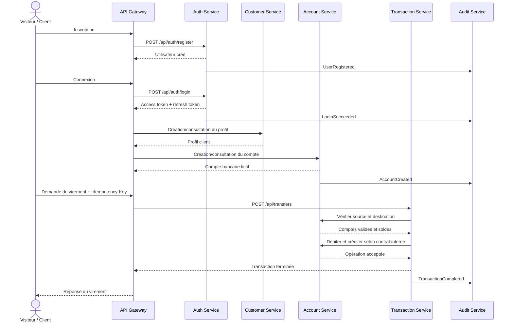

# SecureMicroservicesBank — Cas d’utilisation

**Document :** Description des cas d’utilisation du MVP  
**Projet :** SecureMicroservicesBank  
**Version :** 1.0  
**Statut :** Brouillon de conception fonctionnelle  
**Document parent :** `docs/project-scope.md`  
**Référence :** Cahier des charges SecureMicroservicesBank, version 1.0 du 19 juin 2026

---

## 1. Objectif du document

Ce document décrit les cas d’utilisation du premier produit fonctionnel de SecureMicroservicesBank.

Il précise pour chaque fonctionnalité :

- l’acteur principal ;
- les acteurs secondaires ;
- les préconditions ;
- le déclencheur ;
- le scénario nominal ;
- les scénarios alternatifs et d’erreur ;
- les règles métier et de sécurité ;
- les événements d’audit ;
- les réponses HTTP principales ;
- les critères d’acceptation.

Le document sert de référence commune pour :

- la conception des APIs ;
- le développement des microservices ;
- la rédaction des tests ;
- le contrôle des autorisations ;
- la traçabilité entre les exigences et l’implémentation.

---

## 2. Périmètre couvert

Les cas d’utilisation concernent le MVP composé des services suivants :

- `api-gateway` ;
- `auth-service` ;
- `customer-service` ;
- `account-service` ;
- `transaction-service` ;
- `audit-service`.

Les éléments suivants ne sont pas détaillés dans cette version :

- analyse de risque avancée ;
- notifications asynchrones ;
- reporting avancé ;
- MFA des opérations sensibles ;
- fonctionnalités Kubernetes et DevSecOps ;
- sécurité runtime.

Ils seront ajoutés progressivement après validation du flux principal.

---

## 3. Acteurs

### 3.1 Visiteur

Utilisateur non authentifié.

Peut :

- créer un compte utilisateur ;
- se connecter.

### 3.2 Client bancaire

Utilisateur authentifié avec le rôle `CLIENT`.

Peut :

- consulter et modifier son propre profil ;
- consulter uniquement ses propres comptes ;
- consulter son solde ;
- effectuer un virement depuis un compte qui lui appartient ;
- consulter uniquement ses propres transactions.

### 3.3 Administrateur

Utilisateur authentifié avec le rôle `ADMIN`.

Peut :

- consulter les clients ;
- activer ou désactiver un client ;
- créer un compte bancaire pour un client selon la politique retenue ;
- bloquer ou débloquer un compte ;
- consulter les événements d’audit autorisés.

Ne peut pas modifier directement le solde d’un compte.

### 3.4 Auditeur

Utilisateur authentifié avec le rôle `AUDITOR`.

Peut :

- consulter les événements d’audit ;
- filtrer les événements ;
- consulter le détail d’un événement.

Ne peut modifier ni supprimer les journaux d’audit.

### 3.5 Système

Représente les composants techniques exécutant automatiquement certaines actions :

- validation d’un token ;
- génération d’un identifiant de corrélation ;
- blocage après plusieurs échecs ;
- création d’un événement d’audit ;
- gestion de l’idempotence.

---

## 4. Principes transversaux

Tous les cas d’utilisation doivent respecter les principes suivants.

### 4.1 Authentification

- Les endpoints protégés exigent un access token valide.
- Un token absent, invalide ou expiré entraîne une réponse `401 Unauthorized`.
- Le token doit contenir au minimum l’identifiant de l’utilisateur et ses rôles.

### 4.2 Autorisation

- Les rôles sont contrôlés côté backend.
- Un client ne peut jamais accéder à la ressource d’un autre client.
- Une autorisation par rôle ne remplace pas la vérification de propriété.
- Un accès interdit entraîne généralement `403 Forbidden`.
- Un `404 Not Found` peut être préféré lorsque révéler l’existence de la ressource présente un risque.

### 4.3 Validation

- Toutes les entrées sont validées côté serveur.
- Les identifiants doivent avoir le format attendu.
- Les montants utilisent `BigDecimal` côté Java et `NUMERIC` côté PostgreSQL.
- Les messages retournés au client ne doivent pas révéler d’informations sensibles.

### 4.4 Traçabilité

- Chaque requête reçoit un `correlationId`.
- Le `correlationId` est propagé entre les services.
- Toute opération sensible produit un événement d’audit.
- Aucun mot de passe, token ou secret n’est enregistré dans les logs.

### 4.5 Idempotence

- Les virements exigent une clé d’idempotence.
- Une même clé et une même requête retournent le résultat initial.
- Une même clé utilisée avec un contenu différent produit un conflit.

---

## 5. Vue d’ensemble des cas d’utilisation

| Identifiant | Cas d’utilisation | Acteur principal | Service principal | Priorité MVP |
|---|---|---|---|---|
| UC-AUTH-01 | Créer un compte utilisateur | Visiteur | auth-service | Obligatoire |
| UC-AUTH-02 | Se connecter | Visiteur | auth-service | Obligatoire |
| UC-AUTH-03 | Rafraîchir l’access token | Client/Admin/Auditeur | auth-service | Obligatoire |
| UC-AUTH-04 | Se déconnecter | Client/Admin/Auditeur | auth-service | Obligatoire |
| UC-CUST-01 | Créer un profil client | Système/Admin | customer-service | Obligatoire |
| UC-CUST-02 | Consulter son profil | Client | customer-service | Obligatoire |
| UC-CUST-03 | Modifier son profil | Client | customer-service | Obligatoire |
| UC-CUST-04 | Activer ou désactiver un client | Administrateur | customer-service | Obligatoire |
| UC-ACC-01 | Créer un compte bancaire fictif | Administrateur/Système | account-service | Obligatoire |
| UC-ACC-02 | Lister ses comptes | Client | account-service | Obligatoire |
| UC-ACC-03 | Consulter le détail d’un compte | Client/Admin | account-service | Obligatoire |
| UC-ACC-04 | Bloquer un compte | Administrateur | account-service | Obligatoire |
| UC-ACC-05 | Débloquer un compte | Administrateur | account-service | Obligatoire |
| UC-TRX-01 | Effectuer un virement interne | Client | transaction-service | Obligatoire |
| UC-TRX-02 | Lister ses transactions | Client | transaction-service | Obligatoire |
| UC-TRX-03 | Consulter une transaction | Client/Admin | transaction-service | Obligatoire |
| UC-AUD-01 | Enregistrer un événement d’audit | Système | audit-service | Obligatoire |
| UC-AUD-02 | Rechercher les événements d’audit | Auditeur/Admin | audit-service | Obligatoire |
| UC-AUD-03 | Consulter un événement d’audit | Auditeur/Admin | audit-service | Obligatoire |

---

## 6. Parcours principal du MVP



Ce diagramme représente le parcours fonctionnel cible. Les détails de cohérence distribuée seront précisés lors de la conception technique du `transaction-service`.

---

# 7. Cas d’utilisation d’authentification

## UC-AUTH-01 — Créer un compte utilisateur

### Informations générales

| Élément | Valeur |
|---|---|
| Acteur principal | Visiteur |
| Service principal | `auth-service` |
| Endpoint envisagé | `POST /api/auth/register` |
| Priorité | Obligatoire |

### Objectif

Permettre à un visiteur de créer un compte utilisateur avec un email unique et un mot de passe sécurisé.

### Préconditions

- Le visiteur n’est pas authentifié.
- L’email fourni n’est pas déjà utilisé.
- Le service d’authentification et sa base de données sont disponibles.

### Données d’entrée minimales

```json
{
  "email": "client@example.com",
  "password": "StrongPassword123!",
  "firstName": "Client",
  "lastName": "Demo"
}
```

La présence de `firstName` et `lastName` dépendra de la décision finale sur la création du profil client.

### Scénario nominal

1. Le visiteur envoie sa demande d’inscription.
2. L’API Gateway ajoute ou propage un `correlationId`.
3. Le `auth-service` valide la syntaxe de l’email.
4. Le service vérifie la politique de mot de passe.
5. Le service vérifie que l’email est unique.
6. Le mot de passe est haché avec BCrypt ou Argon2.
7. Un utilisateur est créé avec le rôle `CLIENT`.
8. Le compte est initialement activé selon la politique du MVP.
9. Un événement `USER_REGISTERED` est produit pour l’audit.
10. Le système retourne une réponse de création sans mot de passe ni hash.

### Résultat attendu

- L’utilisateur existe dans la base du `auth-service`.
- Aucun mot de passe en clair n’est stocké.
- Le rôle attribué est `CLIENT`.
- Un événement d’audit est enregistré.

### Scénarios alternatifs et erreurs

#### A1 — Email déjà utilisé

- Le service détecte un email existant.
- Aucun nouvel utilisateur n’est créé.
- Réponse : `409 Conflict`.
- Code métier : `EMAIL_ALREADY_EXISTS`.

#### A2 — Mot de passe insuffisamment fort

- La politique de mot de passe n’est pas respectée.
- Réponse : `400 Bad Request`.
- Code métier : `WEAK_PASSWORD`.

#### A3 — Email invalide

- Le format de l’email est incorrect.
- Réponse : `400 Bad Request`.

#### A4 — Erreur interne

- Une erreur technique empêche la création.
- Réponse générique : `500 Internal Server Error`.
- Les détails restent dans les logs internes.

### Règles métier et de sécurité

- L’email est unique et normalisé avant comparaison.
- Le rôle `ADMIN` ne peut pas être choisi lors d’une inscription publique.
- Le mot de passe n’est jamais retourné dans la réponse.
- Le mot de passe n’est jamais écrit dans les logs.
- Le stockage doit contenir uniquement un hash sécurisé.

### Événements d’audit

- `USER_REGISTERED` en cas de succès.
- `USER_REGISTRATION_FAILED` en cas d’échec significatif, sans enregistrer le mot de passe.

### Réponses HTTP principales

| Code | Signification |
|---|---|
| `201 Created` | Utilisateur créé |
| `400 Bad Request` | Données invalides |
| `409 Conflict` | Email déjà utilisé |
| `500 Internal Server Error` | Erreur inattendue |

### Critères d’acceptation

- Un email valide et nouveau permet la création.
- Le mot de passe stocké est différent du mot de passe reçu.
- Deux inscriptions avec le même email ne créent pas deux utilisateurs.
- Le client ne peut pas s’attribuer un rôle privilégié.
- La réponse ne contient aucun champ sensible.

---

## UC-AUTH-02 — Se connecter

### Informations générales

| Élément | Valeur |
|---|---|
| Acteur principal | Visiteur |
| Service principal | `auth-service` |
| Endpoint envisagé | `POST /api/auth/login` |
| Priorité | Obligatoire |

### Objectif

Authentifier un utilisateur et lui fournir un access token court ainsi qu’un refresh token.

### Préconditions

- L’utilisateur existe.
- Le compte utilisateur est actif.
- Le compte n’est pas temporairement verrouillé.

### Données d’entrée

```json
{
  "email": "client@example.com",
  "password": "StrongPassword123!"
}
```

### Scénario nominal

1. Le visiteur envoie ses identifiants.
2. Le service recherche l’utilisateur par email normalisé.
3. Le service vérifie que le compte est actif et non verrouillé.
4. Le mot de passe reçu est comparé au hash stocké.
5. Le compteur d’échecs est réinitialisé.
6. Un access token à durée courte est généré.
7. Un refresh token est généré.
8. Le refresh token est stocké sous une forme adaptée à la politique de sécurité.
9. Un événement `LOGIN_SUCCEEDED` est enregistré.
10. Les tokens et leur durée de validité sont retournés.

### Réponse indicative

```json
{
  "accessToken": "eyJhbGciOi...",
  "refreshToken": "opaque-or-jwt-refresh-token",
  "tokenType": "Bearer",
  "expiresIn": 900
}
```

### Scénarios alternatifs et erreurs

#### A1 — Identifiants incorrects

- Le service ne révèle pas si l’email ou le mot de passe est incorrect.
- Le compteur d’échecs est incrémenté si l’utilisateur est identifiable.
- Réponse : `401 Unauthorized`.
- Message générique : `Invalid credentials`.

#### A2 — Seuil d’échecs atteint

- Le compte est temporairement verrouillé.
- La date `lockedUntil` est enregistrée.
- Un événement `ACCOUNT_TEMPORARILY_LOCKED` est produit.
- Réponse : `429 Too Many Requests` ou `423 Locked`, selon la politique finale.

#### A3 — Compte désactivé

- L’authentification est refusée.
- Réponse : `403 Forbidden` ou réponse générique définie par la politique de sécurité.

#### A4 — Token non généré

- Une erreur technique empêche la création des tokens.
- Aucune authentification partielle n’est considérée comme réussie.
- Réponse : `500 Internal Server Error`.

### Règles métier et de sécurité

- Les erreurs de connexion ne révèlent pas si un email existe.
- Le rate limiting est appliqué par IP et/ou utilisateur.
- L’access token a une durée de vie courte.
- Les secrets de signature ne sont pas stockés dans le code.
- Les tokens ne sont pas journalisés.

### Événements d’audit

- `LOGIN_SUCCEEDED`.
- `LOGIN_FAILED`.
- `ACCOUNT_TEMPORARILY_LOCKED`.

### Réponses HTTP principales

| Code | Signification |
|---|---|
| `200 OK` | Connexion réussie |
| `400 Bad Request` | Requête invalide |
| `401 Unauthorized` | Identifiants invalides |
| `403 Forbidden` | Compte désactivé selon politique |
| `429 Too Many Requests` | Trop de tentatives |

### Critères d’acceptation

- Des identifiants valides produisent un access token et un refresh token.
- Un mot de passe incorrect ne produit aucun token.
- Plusieurs échecs provoquent un verrouillage temporaire.
- Une connexion réussie réinitialise le compteur d’échecs.
- Aucun token ou mot de passe n’apparaît dans les logs.

---

## UC-AUTH-03 — Rafraîchir l’access token

### Informations générales

| Élément | Valeur |
|---|---|
| Acteur principal | Utilisateur authentifié précédemment |
| Service principal | `auth-service` |
| Endpoint envisagé | `POST /api/auth/refresh` |
| Priorité | Obligatoire |

### Objectif

Obtenir un nouvel access token sans demander à l’utilisateur de se reconnecter avec son mot de passe.

### Préconditions

- Un refresh token valide a été délivré.
- Le refresh token n’est ni expiré ni révoqué.
- Le compte utilisateur est toujours actif.

### Scénario nominal

1. Le client transmet son refresh token.
2. Le service vérifie sa validité.
3. Le service vérifie qu’il n’est pas révoqué.
4. Le service vérifie l’état du compte utilisateur.
5. Le refresh token courant est invalidé ou marqué comme utilisé.
6. Un nouvel access token est généré.
7. Un nouveau refresh token est généré selon le principe de rotation.
8. Le nouveau couple de tokens est retourné.
9. Un événement `TOKEN_REFRESHED` est enregistré.

### Scénarios alternatifs et erreurs

- Refresh token absent : `400 Bad Request`.
- Refresh token invalide ou expiré : `401 Unauthorized`.
- Refresh token révoqué : `401 Unauthorized`.
- Réutilisation détectée d’un ancien token : révocation de la session ou de la famille de tokens selon la politique.
- Compte désactivé : accès refusé.

### Règles métier et de sécurité

- Le refresh token est rotatif.
- Un token révoqué ne peut jamais produire un nouvel access token.
- Une éventuelle réutilisation suspecte doit être auditée.

### Événements d’audit

- `TOKEN_REFRESHED`.
- `REFRESH_TOKEN_REUSE_DETECTED`.
- `TOKEN_REFRESH_FAILED`.

### Critères d’acceptation

- Un refresh token valide fournit de nouveaux tokens.
- L’ancien refresh token devient inutilisable après rotation.
- Un token expiré ou révoqué est refusé.

---

## UC-AUTH-04 — Se déconnecter

### Informations générales

| Élément | Valeur |
|---|---|
| Acteur principal | Client, Administrateur ou Auditeur |
| Service principal | `auth-service` |
| Endpoint envisagé | `POST /api/auth/logout` |
| Priorité | Obligatoire |

### Objectif

Révoquer la session ou le refresh token de l’utilisateur.

### Préconditions

- L’utilisateur possède un refresh token ou une session connue.

### Scénario nominal

1. L’utilisateur demande la déconnexion.
2. Le service identifie le refresh token ou la session.
3. Le token est marqué comme révoqué.
4. Un événement `LOGOUT_SUCCEEDED` est enregistré.
5. Le service retourne une réponse sans contenu.

### Scénarios alternatifs

- Le token est déjà révoqué : la déconnexion reste sans effet supplémentaire et peut être traitée comme idempotente.
- Le token est invalide : réponse adaptée sans révéler de détails sensibles.

### Réponses HTTP principales

- `204 No Content` en cas de succès.
- `400 Bad Request` si la requête est inutilisable.
- `401 Unauthorized` si la politique exige une session encore valide.

### Critères d’acceptation

- Après déconnexion, le refresh token ne permet plus de générer un access token.
- Répéter la déconnexion ne réactive jamais la session.

---

# 8. Cas d’utilisation de gestion client

## UC-CUST-01 — Créer un profil client

### Informations générales

| Élément | Valeur |
|---|---|
| Acteur principal | Système ou Administrateur |
| Service principal | `customer-service` |
| Endpoint envisagé | `POST /api/customers` ou flux interne après inscription |
| Priorité | Obligatoire |

### Objectif

Créer le profil bancaire fictif associé à un utilisateur authentifié.

### Préconditions

- L’utilisateur existe dans le `auth-service`.
- Aucun profil client n’est déjà associé au même `authUserId`.

### Scénario nominal

1. Le système reçoit les informations minimales du client.
2. Le service valide les données.
3. Le service vérifie l’unicité de `authUserId`.
4. Un numéro client fictif unique est généré.
5. Le profil est créé avec le statut `ACTIVE` ou `PENDING` selon la décision finale.
6. Un événement `CUSTOMER_CREATED` est enregistré.
7. Le profil non sensible est retourné.

### Scénarios alternatifs et erreurs

- Profil déjà existant pour l’utilisateur : `409 Conflict`.
- Utilisateur source inexistant ou non vérifiable : `400 Bad Request` ou erreur de dépendance interne.
- Données invalides : `400 Bad Request`.

### Règles métier et de sécurité

- Un utilisateur ne possède qu’un profil client principal dans le MVP.
- Les données doivent rester fictives.
- Les champs sensibles ne sont pas exposés inutilement.

### Critères d’acceptation

- Un profil unique est créé pour un utilisateur valide.
- Une seconde création avec le même `authUserId` échoue.
- Le numéro client est unique.

---

## UC-CUST-02 — Consulter son profil

### Informations générales

| Élément | Valeur |
|---|---|
| Acteur principal | Client |
| Service principal | `customer-service` |
| Endpoint envisagé | `GET /api/customers/me` |
| Priorité | Obligatoire |

### Objectif

Permettre à un client de consulter uniquement son propre profil.

### Préconditions

- Le client est authentifié.
- Le token contient ou permet de retrouver son identifiant utilisateur.
- Un profil client lui est associé.

### Scénario nominal

1. Le client appelle l’endpoint `/me`.
2. L’API vérifie le token.
3. Le service récupère l’identifiant utilisateur authentifié.
4. Le profil associé est recherché.
5. Les données autorisées sont retournées.

### Scénarios alternatifs et erreurs

- Token absent ou invalide : `401 Unauthorized`.
- Profil inexistant : `404 Not Found`.
- Compte client désactivé : accès refusé selon la politique.

### Règles de sécurité

- Le client ne fournit pas librement un `customerId` pour consulter son propre profil.
- L’identité est dérivée du contexte authentifié.
- Les données sensibles sont masquées ou absentes de la réponse.

### Critères d’acceptation

- Un client authentifié obtient son profil.
- Il ne peut pas remplacer un identifiant dans l’URL pour obtenir un autre profil.
- La réponse ne contient pas de données d’authentification.

---

## UC-CUST-03 — Modifier son profil

### Informations générales

| Élément | Valeur |
|---|---|
| Acteur principal | Client |
| Service principal | `customer-service` |
| Endpoint envisagé | `PUT /api/customers/me` ou `PATCH /api/customers/me` |
| Priorité | Obligatoire |

### Objectif

Modifier les informations personnelles autorisées du client.

### Préconditions

- Le client est authentifié.
- Le profil existe et est modifiable.

### Champs modifiables possibles

- prénom ;
- nom ;
- téléphone fictif ;
- adresse fictive ;
- préférences non sensibles.

### Champs non modifiables directement

- `id` ;
- `authUserId` ;
- numéro client ;
- rôle ;
- statut administratif ;
- informations d’authentification.

### Scénario nominal

1. Le client envoie les champs modifiables.
2. Le service vérifie l’identité du client.
3. Les données sont validées.
4. Le profil est mis à jour.
5. Un événement `CUSTOMER_PROFILE_UPDATED` est enregistré.
6. Le profil mis à jour est retourné.

### Scénarios alternatifs et erreurs

- Champ interdit : `400 Bad Request` ou champ ignoré selon la stratégie retenue.
- Données invalides : `400 Bad Request`.
- Profil inexistant : `404 Not Found`.

### Critères d’acceptation

- Les champs autorisés peuvent être modifiés.
- Les champs protégés restent inchangés.
- Un événement d’audit est créé.

---

## UC-CUST-04 — Activer ou désactiver un client

### Informations générales

| Élément | Valeur |
|---|---|
| Acteur principal | Administrateur |
| Service principal | `customer-service` |
| Endpoint envisagé | `PATCH /api/admin/customers/{customerId}/status` |
| Priorité | Obligatoire |

### Objectif

Permettre à un administrateur de changer le statut administratif d’un client.

### Préconditions

- L’administrateur est authentifié avec le rôle `ADMIN`.
- Le client cible existe.

### Scénario nominal

1. L’administrateur transmet le nouveau statut.
2. Le service vérifie le rôle `ADMIN`.
3. Le service vérifie la transition de statut.
4. Le statut est mis à jour.
5. Un événement `CUSTOMER_STATUS_CHANGED` est enregistré avec l’acteur administrateur.
6. Le nouveau statut est retourné.

### Scénarios alternatifs et erreurs

- Utilisateur sans rôle `ADMIN` : `403 Forbidden`.
- Client inexistant : `404 Not Found`.
- Statut inconnu ou transition interdite : `400 Bad Request` ou `409 Conflict`.

### Critères d’acceptation

- Un administrateur peut désactiver et réactiver un client selon les règles.
- Un client ne peut pas modifier lui-même son statut.
- L’auteur, l’ancien statut et le nouveau statut sont auditables.

---

# 9. Cas d’utilisation de gestion des comptes

## UC-ACC-01 — Créer un compte bancaire fictif

### Informations générales

| Élément | Valeur |
|---|---|
| Acteur principal | Administrateur ou Système |
| Service principal | `account-service` |
| Endpoint envisagé | `POST /api/accounts` |
| Priorité | Obligatoire |

### Objectif

Créer un compte bancaire fictif appartenant à un client existant.

### Préconditions

- Le client existe et est actif.
- L’acteur possède l’autorisation de créer le compte.
- La devise est supportée.

### Données d’entrée indicatives

```json
{
  "customerId": "9ec13eb7-8f0a-4c76-a461-b6753925f1d2",
  "currency": "MAD"
}
```

### Scénario nominal

1. L’acteur demande la création du compte.
2. Le service vérifie l’autorisation.
3. Le service vérifie l’existence logique et le statut du client.
4. Un numéro de compte fictif unique est généré.
5. Le solde initial est fixé selon la politique, généralement `0.00`.
6. Le compte est créé avec le statut `ACTIVE`.
7. Un événement `ACCOUNT_CREATED` est enregistré.
8. Le compte créé est retourné.

### Scénarios alternatifs et erreurs

- Client inexistant : `404 Not Found` ou erreur métier correspondante.
- Client désactivé : `409 Conflict` ou `403 Forbidden` selon la politique.
- Devise non supportée : `400 Bad Request`.
- Numéro généré en conflit : nouvelle génération ou erreur interne contrôlée.

### Règles métier et de sécurité

- Le numéro de compte est unique.
- Le solde initial n’est pas librement choisi par le client.
- Un administrateur ne peut pas fournir un solde arbitraire.
- Les données utilisées sont fictives.

### Critères d’acceptation

- Un compte valide est lié au bon client.
- Le solde initial respecte la politique définie.
- Le client ne peut pas créer un compte pour une autre personne.

---

## UC-ACC-02 — Lister ses comptes

### Informations générales

| Élément | Valeur |
|---|---|
| Acteur principal | Client |
| Service principal | `account-service` |
| Endpoint envisagé | `GET /api/accounts` |
| Priorité | Obligatoire |

### Objectif

Retourner uniquement les comptes appartenant au client authentifié.

### Préconditions

- Le client est authentifié.
- Son profil ou identifiant client est résolu.

### Scénario nominal

1. Le client demande la liste de ses comptes.
2. Le service détermine son `customerId` depuis le contexte autorisé.
3. Le repository recherche les comptes appartenant à ce client.
4. Une liste paginée ou simple est retournée selon le volume prévu.

### Scénarios alternatifs

- Aucun compte : retour `200 OK` avec une liste vide.
- Token invalide : `401 Unauthorized`.
- Profil client absent : `404 Not Found` ou erreur de cohérence interne.

### Règles de sécurité

- Un paramètre `customerId` fourni par le client ne doit pas remplacer l’identité authentifiée.
- La requête repository est limitée au propriétaire.

### Critères d’acceptation

- Le client voit tous ses comptes et aucun compte d’un autre client.
- Une liste vide ne produit pas une erreur technique.

---

## UC-ACC-03 — Consulter le détail d’un compte

### Informations générales

| Élément | Valeur |
|---|---|
| Acteur principal | Client ou Administrateur |
| Service principal | `account-service` |
| Endpoint envisagé | `GET /api/accounts/{accountId}` |
| Priorité | Obligatoire |

### Objectif

Consulter le solde, la devise et le statut d’un compte autorisé.

### Préconditions

- L’utilisateur est authentifié.
- Le compte existe.

### Scénario nominal pour un client

1. Le client demande un compte par identifiant.
2. Le service charge le compte.
3. Le service compare le propriétaire du compte au client authentifié.
4. Si la propriété est confirmée, les informations autorisées sont retournées.

### Scénario nominal pour un administrateur

1. L’administrateur demande un compte.
2. Le service vérifie le rôle `ADMIN`.
3. Le compte est retourné selon le niveau de détail autorisé.
4. La consultation administrative peut être auditée si elle est sensible.

### Scénarios alternatifs et erreurs

- Compte inexistant : `404 Not Found`.
- Client non propriétaire : `403 Forbidden` ou `404 Not Found` selon la politique anti-énumération.
- Token invalide : `401 Unauthorized`.

### Critères d’acceptation

- Le propriétaire peut consulter son compte.
- Un autre client ne peut pas le consulter, même en connaissant son identifiant.
- Un administrateur autorisé peut consulter le compte sans modifier le solde.

---

## UC-ACC-04 — Bloquer un compte

### Informations générales

| Élément | Valeur |
|---|---|
| Acteur principal | Administrateur |
| Service principal | `account-service` |
| Endpoint envisagé | `PATCH /api/admin/accounts/{accountId}/status` |
| Priorité | Obligatoire |

### Objectif

Empêcher temporairement toute opération sur un compte.

### Préconditions

- L’acteur possède le rôle `ADMIN`.
- Le compte existe.
- Le compte n’est pas déjà bloqué ou la requête est traitée de manière idempotente.

### Scénario nominal

1. L’administrateur demande le statut `BLOCKED`.
2. Le service vérifie le rôle.
3. Le compte est chargé.
4. Le statut passe de `ACTIVE` à `BLOCKED`.
5. Le solde reste inchangé.
6. Un événement `ACCOUNT_BLOCKED` est enregistré.
7. Le nouveau statut est retourné.

### Scénarios alternatifs et erreurs

- Compte inexistant : `404 Not Found`.
- Utilisateur non administrateur : `403 Forbidden`.
- Compte déjà bloqué : réponse idempotente ou `409 Conflict` selon la politique retenue.
- Tentative de modification du solde dans la même requête : rejet.

### Critères d’acceptation

- Le statut du compte devient `BLOCKED`.
- Le solde reste identique.
- Un virement depuis ou vers ce compte est ensuite refusé.
- L’auteur de l’action est enregistré dans l’audit.

---

## UC-ACC-05 — Débloquer un compte

### Informations générales

| Élément | Valeur |
|---|---|
| Acteur principal | Administrateur |
| Service principal | `account-service` |
| Endpoint envisagé | `PATCH /api/admin/accounts/{accountId}/status` |
| Priorité | Obligatoire |

### Objectif

Réactiver les opérations sur un compte précédemment bloqué.

### Préconditions

- L’acteur possède le rôle `ADMIN`.
- Le compte existe et est bloqué.

### Scénario nominal

1. L’administrateur demande le statut `ACTIVE`.
2. Le service vérifie son rôle.
3. Le service vérifie que le déblocage est autorisé.
4. Le statut passe à `ACTIVE`.
5. Le solde reste inchangé.
6. Un événement `ACCOUNT_UNBLOCKED` est enregistré.

### Critères d’acceptation

- Seul un administrateur peut débloquer le compte.
- Le solde n’est jamais modifié par cette action.
- L’opération est entièrement auditée.

---

# 10. Cas d’utilisation des transactions

## UC-TRX-01 — Effectuer un virement interne

### Informations générales

| Élément | Valeur |
|---|---|
| Acteur principal | Client |
| Services impliqués | `transaction-service`, `account-service`, `audit-service` |
| Endpoint envisagé | `POST /api/transfers` |
| Header obligatoire | `Idempotency-Key` |
| Priorité | Obligatoire et critique |

### Objectif

Transférer un montant positif d’un compte source appartenant au client vers un compte destination existant.

### Préconditions

- Le client est authentifié.
- Le compte source existe et appartient au client.
- Le compte destination existe.
- Les deux comptes sont actifs.
- Le compte source possède un solde suffisant.
- La clé d’idempotence est présente.

### Données d’entrée

```http
Idempotency-Key: 5fa8c613-fd17-47b6-a985-747a57278f8c
```

```json
{
  "sourceAccountId": "a2876e27-3296-44ed-bb4a-8ca7745982e1",
  "destinationAccountId": "290648cc-e951-48c1-8da8-ceaa1eb2623f",
  "amount": 500.00,
  "currency": "MAD"
}
```

### Scénario nominal

1. Le client envoie la demande avec une clé d’idempotence.
2. L’API Gateway authentifie la requête et ajoute un `correlationId`.
3. Le `transaction-service` valide le format des données.
4. Le service vérifie que la clé d’idempotence n’a pas déjà été utilisée.
5. Le service vérifie que les comptes source et destination sont différents.
6. Le service demande au `account-service` les informations nécessaires.
7. Le `account-service` vérifie que le compte source appartient au client.
8. Les deux comptes sont vérifiés comme actifs.
9. Le solde disponible du compte source est vérifié.
10. Le transfert est exécuté selon le mécanisme de cohérence retenu.
11. Une transaction avec un identifiant unique est enregistrée.
12. Son statut devient `COMPLETED`.
13. Le résultat est associé à la clé d’idempotence.
14. Un événement `TRANSACTION_COMPLETED` est envoyé à l’audit.
15. Le résultat est retourné au client.

### Réponse indicative

```json
{
  "transactionId": "62fbb95a-26e0-4347-ac96-cdf18dc597da",
  "sourceAccountId": "a2876e27-3296-44ed-bb4a-8ca7745982e1",
  "destinationAccountId": "290648cc-e951-48c1-8da8-ceaa1eb2623f",
  "amount": 500.00,
  "currency": "MAD",
  "status": "COMPLETED",
  "createdAt": "2026-07-21T10:30:00Z"
}
```

### Scénarios alternatifs et erreurs

#### A1 — Clé d’idempotence absente

- La requête est rejetée.
- Réponse : `400 Bad Request`.
- Code métier : `IDEMPOTENCY_KEY_REQUIRED`.

#### A2 — Même clé et même requête

- Le système ne répète pas le débit.
- Il retourne le résultat initial.
- Réponse : généralement `200 OK` avec l’objet déjà créé.

#### A3 — Même clé avec un contenu différent

- Le système détecte un conflit.
- Aucun second virement n’est exécuté.
- Réponse : `409 Conflict`.
- Code métier : `IDEMPOTENCY_KEY_REUSED`.

#### A4 — Montant nul ou négatif

- Réponse : `400 Bad Request`.
- Aucune modification de solde.

#### A5 — Compte source identique au compte destination

- Réponse : `400 Bad Request`.
- Code métier : `SAME_SOURCE_AND_DESTINATION`.

#### A6 — Compte source non propriétaire

- Réponse : `403 Forbidden` ou `404 Not Found` selon la politique de sécurité.
- Événement d’accès interdit si pertinent.

#### A7 — Compte inexistant

- Réponse : `404 Not Found` ou erreur générique ne révélant pas inutilement le compte concerné.

#### A8 — Compte bloqué

- Le virement est refusé.
- Réponse : `409 Conflict`.
- Code métier : `ACCOUNT_BLOCKED`.

#### A9 — Solde insuffisant

- Le virement est refusé.
- Réponse : `409 Conflict` ou `422 Unprocessable Content` selon la convention retenue.
- Code métier : `INSUFFICIENT_BALANCE`.

#### A10 — Erreur pendant l’exécution

- Le système doit éviter un débit sans crédit correspondant.
- Le statut peut devenir `FAILED` ou `PENDING_COMPENSATION` selon l’architecture future.
- Un événement d’échec est enregistré.

#### A11 — Deux virements concurrents

- Le système applique un mécanisme de contrôle de concurrence.
- Le solde ne peut pas devenir incohérent ou négatif par effet de course.

### Règles métier et de sécurité

- Le montant est strictement positif.
- Les montants sont gérés sans `double`.
- Le compte source appartient obligatoirement au client authentifié.
- Un compte bloqué ne peut ni envoyer ni recevoir de virement dans le MVP.
- La clé d’idempotence est unique selon la portée définie.
- La transaction possède un identifiant unique.
- Les erreurs ne révèlent pas les soldes ou détails internes d’un autre client.
- Toute opération produit une trace avec `correlationId`.

### Événements d’audit

- `TRANSACTION_REQUESTED`.
- `TRANSACTION_COMPLETED`.
- `TRANSACTION_REJECTED`.
- `TRANSACTION_FAILED`.
- `UNAUTHORIZED_ACCOUNT_ACCESS_ATTEMPT`, si retenu.

### Réponses HTTP principales

| Code | Signification |
|---|---|
| `201 Created` | Nouveau virement créé |
| `200 OK` | Résultat déjà existant retourné pour la même clé |
| `400 Bad Request` | Données ou clé invalides |
| `401 Unauthorized` | Utilisateur non authentifié |
| `403 Forbidden` | Compte source non autorisé |
| `404 Not Found` | Ressource introuvable selon politique |
| `409 Conflict` | Solde insuffisant, compte bloqué ou conflit d’idempotence |
| `500 Internal Server Error` | Échec inattendu |
| `503 Service Unavailable` | Dépendance temporairement indisponible |

### Critères d’acceptation

- Un virement valide débite une seule fois le compte source.
- Le compte destination est crédité du même montant.
- Un solde insuffisant ne modifie aucun compte.
- Un compte bloqué ne peut pas être utilisé.
- Le client ne peut pas débiter le compte d’un autre client.
- Répéter la même requête avec la même clé ne crée pas un second virement.
- Chaque résultat est consultable et auditable.

---

## UC-TRX-02 — Lister ses transactions

### Informations générales

| Élément | Valeur |
|---|---|
| Acteur principal | Client |
| Service principal | `transaction-service` |
| Endpoint envisagé | `GET /api/transactions` |
| Priorité | Obligatoire |

### Objectif

Consulter l’historique des transactions liées aux comptes du client authentifié.

### Préconditions

- Le client est authentifié.
- Ses comptes ou son identifiant client sont résolus de manière fiable.

### Scénario nominal

1. Le client demande son historique.
2. Le service identifie les comptes autorisés.
3. Les transactions sortantes et entrantes correspondantes sont recherchées.
4. Les résultats sont paginés.
5. Le client reçoit uniquement les données autorisées.

### Filtres possibles

- statut ;
- date de début ;
- date de fin ;
- compte ;
- sens entrant ou sortant.

### Scénarios alternatifs

- Aucun résultat : `200 OK` avec liste vide.
- Filtre invalide : `400 Bad Request`.
- Demande sur un compte non propriétaire : refus.

### Critères d’acceptation

- Le client ne voit que les transactions liées à ses comptes.
- La pagination est stable.
- Les filtres ne permettent pas de contourner l’autorisation.

---

## UC-TRX-03 — Consulter une transaction

### Informations générales

| Élément | Valeur |
|---|---|
| Acteur principal | Client ou Administrateur |
| Service principal | `transaction-service` |
| Endpoint envisagé | `GET /api/transactions/{transactionId}` |
| Priorité | Obligatoire |

### Objectif

Consulter le détail d’une transaction autorisée.

### Scénario nominal pour un client

1. Le client demande une transaction.
2. Le service charge la transaction.
3. Il vérifie que le client possède le compte source ou destination.
4. Les informations autorisées sont retournées.

### Scénario nominal pour un administrateur

1. L’administrateur demande une transaction.
2. Le rôle est vérifié.
3. Le détail autorisé est retourné.
4. La consultation peut être auditée selon la sensibilité.

### Scénarios alternatifs

- Transaction inexistante : `404 Not Found`.
- Client non concerné : `403 Forbidden` ou `404 Not Found`.

### Critères d’acceptation

- Un client concerné peut consulter la transaction.
- Un client tiers ne peut pas la consulter.
- Le détail ne contient aucun secret ni donnée technique interne.

---

# 11. Cas d’utilisation de l’audit

## UC-AUD-01 — Enregistrer un événement d’audit

### Informations générales

| Élément | Valeur |
|---|---|
| Acteur principal | Système |
| Service principal | `audit-service` |
| Déclenchement | Appel interne ou événement |
| Priorité | Obligatoire |

### Objectif

Créer une trace durable et non modifiable par les APIs standards pour toute opération sensible.

### Données minimales d’un événement

```json
{
  "eventType": "TRANSACTION_COMPLETED",
  "actorId": "7f532378-5506-4d25-a43c-6810314fd22f",
  "actorRole": "CLIENT",
  "action": "TRANSFER",
  "resourceType": "TRANSACTION",
  "resourceId": "62fbb95a-26e0-4347-ac96-cdf18dc597da",
  "result": "SUCCESS",
  "severity": "INFO",
  "ipAddress": "192.0.2.10",
  "correlationId": "req-4d1d4108",
  "occurredAt": "2026-07-21T10:30:00Z"
}
```

### Scénario nominal

1. Un service métier produit un événement d’audit.
2. L’`audit-service` valide le schéma.
3. L’événement reçoit un identifiant unique.
4. La date et les métadonnées nécessaires sont conservées.
5. L’événement est stocké en mode append-only logique.
6. Un accusé de réception technique est retourné si le mode est synchrone.

### Scénarios alternatifs et erreurs

- Événement invalide : rejet et log technique sécurisé.
- `audit-service` indisponible : application d’une stratégie de retry, queue ou persistance locale selon la phase technique.
- Événement dupliqué : déduplication possible à partir d’un `eventId` unique.

### Règles métier et de sécurité

- Aucune API standard de mise à jour ou suppression n’est exposée.
- Les données sensibles ne sont pas copiées dans le payload.
- Le mot de passe, les tokens et les secrets sont interdits.
- L’identité du service émetteur doit être vérifiable dans la version avancée.

### Critères d’acceptation

- Une opération sensible produit un événement.
- L’événement contient acteur, action, résultat, date et correlation ID.
- Il ne peut pas être modifié ou supprimé via l’API fonctionnelle.

---

## UC-AUD-02 — Rechercher les événements d’audit

### Informations générales

| Élément | Valeur |
|---|---|
| Acteur principal | Auditeur ou Administrateur |
| Service principal | `audit-service` |
| Endpoint envisagé | `GET /api/audit-events` |
| Priorité | Obligatoire |

### Objectif

Consulter une liste filtrée et paginée d’événements d’audit.

### Préconditions

- L’utilisateur est authentifié.
- Il possède le rôle `AUDITOR` ou `ADMIN`.

### Filtres prévus

- acteur ;
- action ;
- type d’événement ;
- type de ressource ;
- résultat ;
- sévérité ;
- période ;
- correlation ID.

### Scénario nominal

1. L’acteur envoie une requête avec des filtres facultatifs.
2. Le service vérifie son rôle.
3. Les filtres sont validés.
4. Les résultats sont triés et paginés.
5. Les événements autorisés sont retournés.
6. La consultation peut elle-même être auditée.

### Scénarios alternatifs

- Rôle insuffisant : `403 Forbidden`.
- Filtre invalide : `400 Bad Request`.
- Aucun résultat : `200 OK` avec liste vide.

### Critères d’acceptation

- Un auditeur peut rechercher sans modifier les données.
- Un client ne peut jamais accéder à cet endpoint.
- Les résultats sont paginés.

---

## UC-AUD-03 — Consulter un événement d’audit

### Informations générales

| Élément | Valeur |
|---|---|
| Acteur principal | Auditeur ou Administrateur |
| Service principal | `audit-service` |
| Endpoint envisagé | `GET /api/audit-events/{eventId}` |
| Priorité | Obligatoire |

### Objectif

Consulter le détail d’un événement d’audit précis.

### Scénario nominal

1. L’acteur demande un événement.
2. Son rôle est vérifié.
3. L’événement est recherché.
4. Les champs autorisés sont retournés.

### Scénarios alternatifs

- Événement inexistant : `404 Not Found`.
- Rôle insuffisant : `403 Forbidden`.

### Critères d’acceptation

- Le détail est accessible uniquement aux rôles autorisés.
- Aucun endpoint `PUT`, `PATCH` ou `DELETE` fonctionnel n’est disponible pour les événements d’audit.

---

# 12. Matrice simplifiée des autorisations

| Fonctionnalité | Visiteur | Client | Admin | Auditeur |
|---|---:|---:|---:|---:|
| Inscription | Oui | Non nécessaire | Non nécessaire | Non nécessaire |
| Connexion | Oui | Oui | Oui | Oui |
| Consulter son profil | Non | Oui | Selon endpoint admin | Non |
| Modifier son profil | Non | Oui | Selon politique | Non |
| Activer/désactiver un client | Non | Non | Oui | Non |
| Lister ses comptes | Non | Oui | Selon endpoint admin | Non |
| Consulter son compte | Non | Oui, propriétaire | Oui | Non |
| Créer un compte bancaire | Non | Non dans le MVP | Oui/Système | Non |
| Bloquer/débloquer un compte | Non | Non | Oui | Non |
| Effectuer un virement | Non | Oui, depuis son compte | Non par défaut | Non |
| Consulter ses transactions | Non | Oui | Oui selon endpoint | Non |
| Rechercher les audits | Non | Non | Oui | Oui |
| Modifier/supprimer un audit | Non | Non | Non | Non |

---

# 13. Matrice des événements d’audit

| Action | Événement minimal | Résultat possible | Sévérité indicative |
|---|---|---|---|
| Inscription réussie | `USER_REGISTERED` | SUCCESS | INFO |
| Inscription refusée | `USER_REGISTRATION_FAILED` | FAILURE | WARNING |
| Connexion réussie | `LOGIN_SUCCEEDED` | SUCCESS | INFO |
| Connexion échouée | `LOGIN_FAILED` | FAILURE | WARNING |
| Verrouillage temporaire | `ACCOUNT_TEMPORARILY_LOCKED` | SUCCESS | WARNING |
| Rafraîchissement token | `TOKEN_REFRESHED` | SUCCESS | INFO |
| Réutilisation de token | `REFRESH_TOKEN_REUSE_DETECTED` | FAILURE | HIGH |
| Modification profil | `CUSTOMER_PROFILE_UPDATED` | SUCCESS | INFO |
| Changement statut client | `CUSTOMER_STATUS_CHANGED` | SUCCESS | WARNING |
| Création compte | `ACCOUNT_CREATED` | SUCCESS | INFO |
| Blocage compte | `ACCOUNT_BLOCKED` | SUCCESS | WARNING |
| Déblocage compte | `ACCOUNT_UNBLOCKED` | SUCCESS | WARNING |
| Virement demandé | `TRANSACTION_REQUESTED` | PENDING | INFO |
| Virement réussi | `TRANSACTION_COMPLETED` | SUCCESS | INFO |
| Virement refusé | `TRANSACTION_REJECTED` | FAILURE | WARNING |
| Virement en erreur | `TRANSACTION_FAILED` | FAILURE | HIGH |
| Accès interdit | `UNAUTHORIZED_ACCESS_ATTEMPT` | FAILURE | HIGH |

---

# 14. Format d’erreur commun recommandé

Les microservices devraient retourner un format cohérent.

```json
{
  "timestamp": "2026-07-21T10:30:00Z",
  "status": 409,
  "code": "INSUFFICIENT_BALANCE",
  "message": "The transfer cannot be completed",
  "path": "/api/transfers",
  "correlationId": "req-4d1d4108",
  "details": []
}
```

Principes :

- `code` est stable et exploitable par le frontend ;
- `message` reste générique lorsqu’un détail serait sensible ;
- `correlationId` permet la recherche dans les logs ;
- aucune stack trace n’est retournée ;
- aucune requête SQL n’est exposée ;
- aucun secret ou token n’est inclus.

---

# 15. Scénarios de tests transversaux

Les cas suivants doivent devenir des tests automatisés.

## 15.1 Authentification

- inscription avec email valide ;
- inscription avec email déjà utilisé ;
- mot de passe faible ;
- connexion réussie ;
- connexion avec mot de passe incorrect ;
- verrouillage après plusieurs échecs ;
- refresh token valide ;
- refresh token expiré ;
- réutilisation d’un ancien refresh token ;
- déconnexion et révocation.

## 15.2 Autorisation et propriété

- un client consulte son profil ;
- un client ne consulte pas le profil d’un autre client ;
- un client consulte son compte ;
- un client ne consulte pas le compte d’un autre client ;
- un client ne bloque pas un compte ;
- un administrateur bloque un compte ;
- un auditeur consulte les audits ;
- un auditeur ne modifie aucun audit.

## 15.3 Transactions

- virement valide ;
- montant négatif ;
- solde insuffisant ;
- compte source bloqué ;
- compte destination bloqué ;
- même compte source et destination ;
- compte source appartenant à un autre client ;
- clé d’idempotence absente ;
- même clé et même requête ;
- même clé avec une requête différente ;
- deux virements concurrents sur un solde limité ;
- indisponibilité temporaire du `account-service`.

## 15.4 Audit

- événement créé après une opération sensible ;
- absence de mot de passe ou token dans l’événement ;
- recherche par acteur ;
- recherche par date ;
- recherche par sévérité ;
- absence de routes de modification et de suppression.

---

# 16. Critères globaux de validation du document

Ce document est considéré comme exploitable lorsque :

- chaque fonctionnalité du MVP possède un cas d’utilisation identifié ;
- les acteurs et responsabilités sont non ambigus ;
- les scénarios nominaux sont compréhensibles ;
- les erreurs principales sont définies ;
- les contrôles de propriété sont explicites ;
- les opérations sensibles sont reliées à un événement d’audit ;
- les statuts HTTP sont cohérents ;
- les critères d’acceptation sont transformables en tests.

---

# 17. Décisions restant à confirmer

Les décisions suivantes seront finalisées pendant la conception technique :

1. création automatique ou explicite du profil client après inscription ;
2. acteur autorisé à créer un compte bancaire dans le MVP ;
3. utilisation de `PUT` ou `PATCH` pour le profil client ;
4. réponse `403` ou `404` pour masquer une ressource non autorisée ;
5. statut HTTP exact du verrouillage temporaire ;
6. portée d’une clé d’idempotence : globale, par utilisateur ou par endpoint ;
7. stratégie de transaction distribuée entre `transaction-service` et `account-service` ;
8. communication synchrone ou événementielle avec `audit-service` dans la première version ;
9. niveau de détail visible par un administrateur ;
10. format définitif des identifiants de comptes fictifs.

---

# 18. Prochaine étape

Après validation de ce document, le prochain livrable sera :

```text
docs/business-rules.md
```

Il transformera les règles actuellement présentes dans les cas d’utilisation en exigences formelles et numérotées, notamment :

- règles d’authentification ;
- règles d’autorisation ;
- règles de gestion des clients ;
- règles de gestion des comptes ;
- règles de virement ;
- règles d’idempotence ;
- règles d’audit ;
- règles de validation et de sécurité.
